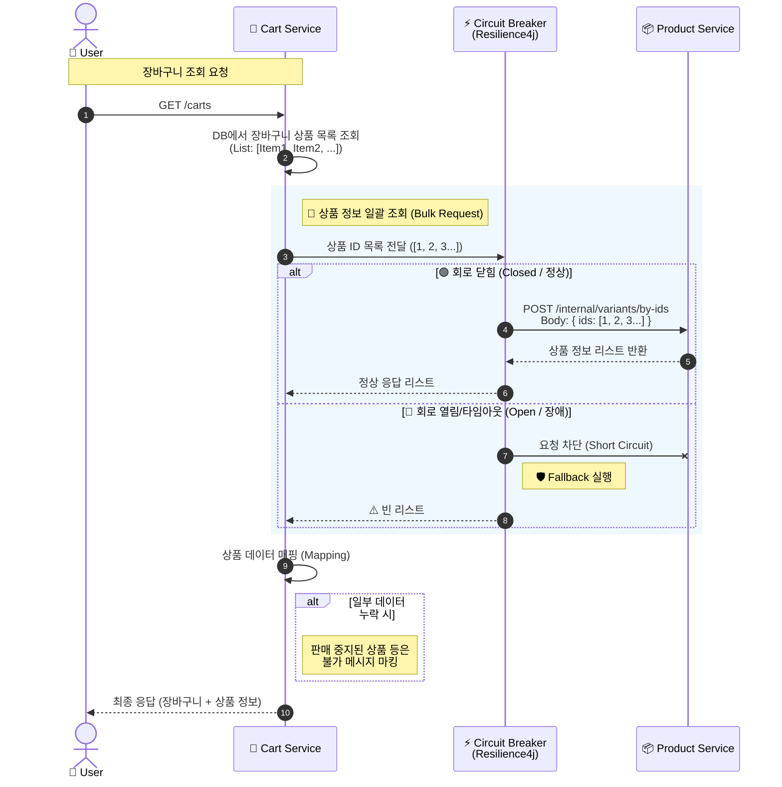
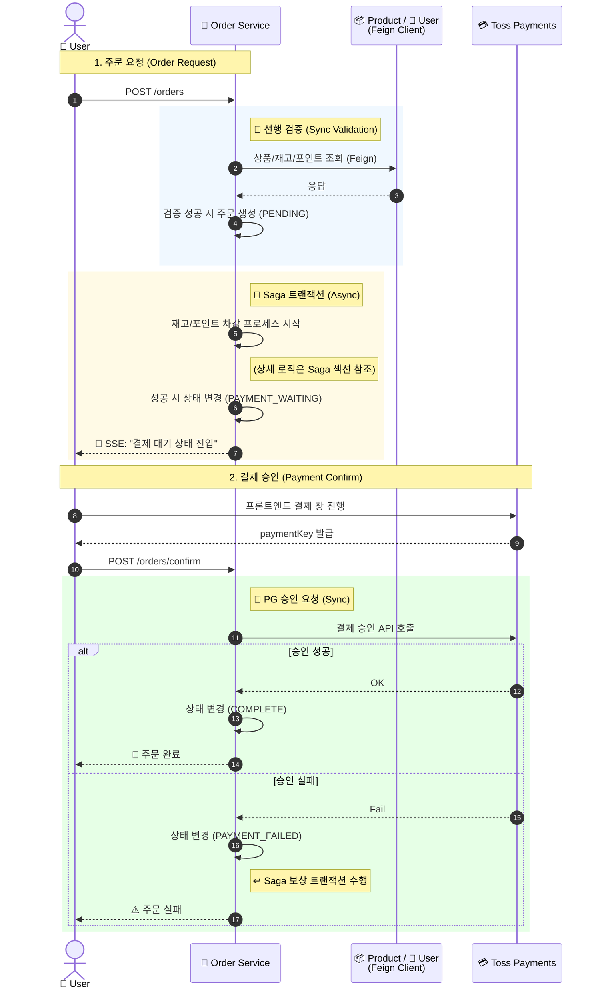
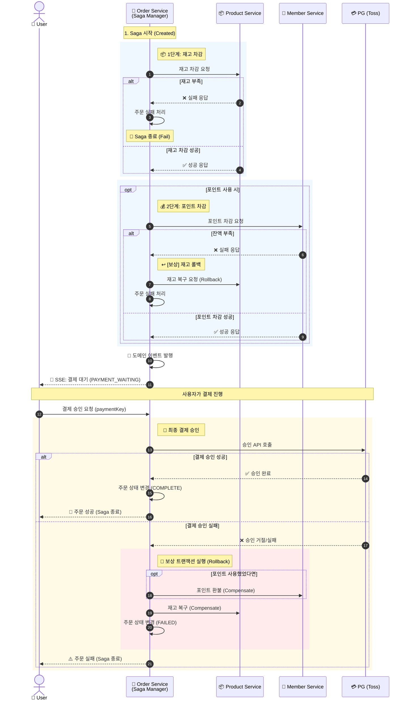

# 📃 Order Service

<div class="base-text">
  주문 서비스는 **주문 도메인** 을 담당하는 마이크로 서비스로, 
  장바구니 상품 추가, 주문 생성, 결제 승인 처리, 주문 조회 등의 핵심 비지니스 로직을 수행합니다.

  또한 Kafka 기반의 Saga 오케스트레이터 역할을 수행하여 주문 생성 이후 재고 차감, 포인트 처리 등 트랜잭션 흐름을 이벤트 기반으로 
  조율하고 Saga 진행중 문제 발생시 보상 흐름을 수행하여 데이터 정합성을 유지하고 트랜잭션 흐름을 이벤트 기반으로 조율하도록 설계하여 
  서비스간의 결합도를 낮춥니다.
</div>

## 🛠️ 기술 스택

<div style={{display: 'flex', gap: '8px', marginBottom: '30px'}}>
  
  
  
  
  
  
</div>

---

## 🏗️ 주요 기능 및 아키텍처

주문 서비스의 주요 도메인은 **Cart(장바구니)**, **Order(주문)**, **SagaInstance(사가 인스턴스)** 등이 있습니다

### 1. 장바구니

<div class="base-text">
  장바구니는 주문 이전에 상품을 담아 관리하기 위한 도메인으로, **장바구니(Cart)**, **장바구니 상품(Cart Item)** 으로 구성됩니다.
  회원은 하나의 장바구니를 가질 수 있으며 장바구니에 여러가지 상품을 추가할 수 있습니다
  장바구니 추가 및 조회 시에는 상품 서비스로의 **Feign Client 기반 동기 호출**을 통해
  상품 정보를 조회하여 최종 응답에 포함하도록 구성되어있습니다.
  또한 외부 서비스 장애로 인한 영향 전파를 방지하기 위해
  **Circuit Breaker** 를 적용하고, 장애 발생 시 **Fallback** 로직을 통해
  대체 응답을 반환하도록 구성했습니다

  비즈니스 규칙에 따라 다음과 같은 제약을 적용했습니다.
  - 판매 중이 아닌 상품은 장바구니에 추가할 수 없음
  - 판매 중이 아닌 상품은 장바구니 수량을 변경할 수 없음
</div>



### 2. 주문 

<div class="base-text">
  주문 도메인은 사용자의 구매 과정을 처리하는 핵심 도메인으로 **주문(Order)**, **주문 상품(OrderItem)**, **결제(Payment)** 로 구성됩니다.

  사용자가 주문을 요청하면 주문 서비스는 상품 서비스와 회원 서비스에
  **동기 호출**을 수행하여 주문에 필요한 상품 정보, 재고 정보, 사용자 정보를 조회합니다.

  다음 조건을 검증하여 주문 가능 여부를 판단합니다.
  - 사용 포인트가 보유 포인트보다 많은 경우 주문 실패
  - 주문 수량이 재고보다 많은 경우 주문 실패

  검증을 통과하면 주문 엔티티를 생성하고 **Spring ApplicationEventPublisher 기반의 도메인 이벤트를 발행하여**
  재고 차감, 포인트 차감을 위한 **Saga 트랜잭션**을 시작합니다.

  이를 통해 주문 생성 로직과 Saga 처리 로직을 분리하여 후속 처리에 대한 결합도를 낮추도록 설계했습니다.

  Saga 진행 상태와 결과는 **SSE(Server-Sent Events)** 를 통해
  클라이언트가 실시간으로 수신할 수 있도록 구현했습니다.

  재고 차감과 포인트 차감이 모두 성공하면
  주문 상태는 **결제 대기 상태**로 변경됩니다.

  이후 사용자가 PG(토스 페이먼츠)를 통해 결제를 진행하고
  paymentKey를 전달하면, 주문 서비스는 토스 페이먼츠에
  **동기 호출로 결제 승인 요청**을 수행합니다.

  결제 승인 성공 시 주문 상태를 **주문 완료**로 변경하고 Saga를 종료하며,
  결제 승인 실패 시 주문을 실패 처리하고
  Saga 보상 트랜잭션을 수행합니다
</div>



### 3. Saga 

<div class="base-text">
  Saga는 주문 처리 과정에서 분산 트랜잭션을 관리하기 위한 도메인으로 **SagaInstance** 를 통해 각 단계의 진행 상태를 관리하도록 설계했습니다.

  주문이 생성되면 Saga 인스턴스가 생성되고,
  순차적으로 **상품 재고 감소 → 유저 포인트 차감** 단계를 수행합니다.
  포인트를 사용하지 않는 주문의 경우 포인트 차감 이벤트는 발행되지 않도록 처리했습니다.
  
  각 단계가 실패할 경우 이전 단계에 대한 **보상 트랜잭션**이 실행되며,
  모든 단계가 성공하면 **Spring ApplicationEventPublisher 기반의 도메인 이벤트를 발행하여**
  주문 상태를 **결제 대기 상태**로 변경합니다.

  또한 외부 서비스 장애나 예외 상황으로 Saga가 장시간 완료되지 않는 경우를 대비하여  
  **Spring Scheduler** 를 사용해 일정 시간이 초과된 Saga를 감지하고  
  보상 트랜잭션을 수행하도록 구현했습니다.
  
  이후 결제 승인 성공 시 Saga를 종료하며,
  결제 승인 실패 시에는 보상 트랜잭션을 수행하여 데이터 정합성을 유지하도록 구성했습니다.
</div>



## 💻 핵심 구현 코드

### 1. Saga Orchestrator (이벤트 기반 트랜잭션 관리)
주문 서비스는 **Saga Orchestrator** 역할을 수행합니다. Kafka를 통해 각 마이크로서비스(상품, 유저)의 처리 결과를 수신하고, 성공/실패 여부에 따라 **다음 단계를 진행**하거나 **보상 트랜잭션(Rollback)** 을 발행하여 데이터 정합성을 보장합니다.

```java
@Slf4j
@Service
@RequiredArgsConstructor
public class SagaManager {

    private final SagaService sagaService;
    private final SagaStepHandlerFactory handlerFactory;
    private final ApplicationEventPublisher applicationEventPublisher;

    public void startSaga(SagaStartCommand command) {
        // payload 생성
        Payload payload = Payload.from(command);
        // 첫번째 단계 생성 [상품 재고 감소]
        SagaStep firstStep = SagaFlow.initialStep(payload);
        // saga 인스턴스 저장
        SagaInstanceDto sagaInstanceDto = sagaService.initialize(command.getOrderNo(), payload, firstStep);
        // sagaHandler를 찾아 saga를 진행
        processStep(sagaInstanceDto);
    }

    public void handleStepResult(SagaStepResultCommand command) {
        SagaInstanceDto saga = sagaService.getSagaByOrderNo(command.getOrderNo());
        if (saga.getSagaStep() != command.getStep()) {
            log.warn("이미 처리되었거나 잘못된 단계의 응답입니다. current={}, result={}",
                    saga.getSagaStep(), command.getStep());
            return;
        }

        if (saga.getSagaStatus() == SagaStatus.STARTED) {
            // 현재 saga가 진행중인 경우
            // 다음 saga 진행
            handleProceedFlow(saga, command);
        } else {
            // 현재 보상이 진행중인 경우
            // 다음 보상 진행
            handleCompensateFlow(saga, command);
        }
    }

    private void handleProceedFlow(SagaInstanceDto saga, SagaStepResultCommand command) {
        if (command.isSuccess()) {
            // saga 결과가 성공인 경우 다음 스텝을 진행
            advanceSequence(saga);
        } else {
            // saga 결과가 실패인 경우 보상 시작 로직을 진행
            startCompensationSequence(saga, command.getErrorCode(), command.getFailureReason());
        }
    }

    private void handleCompensateFlow(SagaInstanceDto saga, SagaStepResultCommand command) {
        if (command.isSuccess()) {
            continueCompensationSequence(saga);
        } else {
            log.error("보상 실패 [위험]");
        }
    }

    private void advanceSequence(SagaInstanceDto saga) {
        // 다음 saga 스텝 조회
        SagaStep nextStep = SagaFlow.from(saga.getSagaStep()).next(saga.getPayload());
        if (nextStep == null) {
            // 다음 saga 스텝이 없으면 saga 종료
            sagaService.finish(saga.getId());
            return;
        }
        // saga 인스턴스 상태 업데이트
        SagaInstanceDto updateSaga = sagaService.proceedTo(saga.getId(), nextStep);
        // 핸들러 찾아 처리 진행
        processStep(updateSaga);
    }

    private void startCompensationSequence(SagaInstanceDto saga, String errorCode, String failureReason) {
        SagaAbortEvent abortEvent = SagaAbortEvent.of(saga.getId(), saga.getOrderNo(), saga.getPayload().getUserId(), errorCode);
        applicationEventPublisher.publishEvent(abortEvent);
        SagaStep compensationStep = SagaFlow.from(saga.getSagaStep()).nextCompensation(saga.getPayload());
        if (compensationStep == null) {
            sagaService.fail(saga.getId(), failureReason);
        } else {
            SagaInstanceDto updateSaga = sagaService.startCompensation(saga.getId(), compensationStep, failureReason);
            compensateStep(updateSaga);
        }
    }

    private void continueCompensationSequence(SagaInstanceDto saga) {
        // 다음 보상 단계
        SagaStep nextStep = SagaFlow.from(saga.getSagaStep()).nextCompensation(saga.getPayload());
        // 다음 단계가 없다면 보상 없이 실패 처리 진행 (이때는 실패 이유는 null)
        if (nextStep == null) {
            sagaService.fail(saga.getId(), null);
            return;
        }
        // Saga 인스턴스 단계를 다음 보상 단계로 변경
        SagaInstanceDto updateSagaInstanceDto = sagaService.continueCompensation(saga.getId(), nextStep);
        // 단계에 맞는 Saga 보상 메시지 발행
        compensateStep(updateSagaInstanceDto);
    }

    public void processTimeouts() {
        //Saga 시작 시간이 10분 이전이면서 상태는 STARTED인 Saga 모두 조회
        LocalDateTime timeout = LocalDateTime.now().minusMinutes(10);
        List<SagaInstanceDto> timeouts = sagaService.getTimeouts(timeout);
        //조회된 SAGA 를 보상 처리함
        for (SagaInstanceDto saga : timeouts) {
            try {
                startCompensationSequence(saga, "SAGA_TIMEOUT", "사가 처리 지연");
            } catch (Exception e) {
                log.error("Timeout 처리 실패 SagaId : {}", saga.getId());
            }
        }
    }

    private void processStep(SagaInstanceDto saga) {
        SagaStepHandler handler = handlerFactory.getHandler(saga.getSagaStep());
        handler.process(saga.getId(), saga.getOrderNo(), saga.getPayload());
    }

    private void compensateStep(SagaInstanceDto saga) {
        SagaStepHandler handler = handlerFactory.getHandler(saga.getSagaStep());
        handler.compensate(saga.getId(), saga.getOrderNo(), saga.getPayload());
    }
}
```

### 2. 도메인 이벤트 기반의 결합도 감소
**주문 저장**과 **Saga 프로세스 시작**을 강하게 결합하지 않고, **Spring ApplicationEventPublisher**를 사용하여 느슨한 결합 구조를 만들었습니다. 
이를 통해 테스트 용이성을 높이고 트랜잭션 경계를 명확히 했습니다.

```java
// OrderFacade
public CreateOrderResponse initialOrder(CreateOrderCommand command){
    // 중복 상품이 있는지 검증
    validateUniqueItems(command.getOrderItemCommands());
    //CompletableFuture 을 사용해서 상품, 유저 요청을 비동기로 동시에 조회
    OrderPreparationData orderPreparationData = getOrderPreparationData(command);
    //주문 상품 가격 정보 계산
    OrderProductAmount productAmount = calculator.calculateItemAmounts(command.getOrderItemCommands(), orderPreparationData.getProducts());
    OrderCouponInfo coupon = orderCouponService.calculateCouponDiscount(command.getUserId(), command.getCouponId(), productAmount);
    //할인 적용 최종 금액 계산
    CalculatedOrderAmounts calculatedOrderAmounts = calculator.calculateOrderPrice(productAmount, coupon, command.getPointToUse(), command.getExpectedPrice());
    // 주문 생성 Context 매핑
    OrderCreationContext creationContext =
            mapper.mapOrderCreationContext(orderPreparationData.getUser(), calculatedOrderAmounts, coupon, command, orderPreparationData.getProducts());
    // 주문 저장
    OrderDto orderDto = orderService.saveOrder(creationContext);
    //SAGA 진행을 위한 이벤트 발행
    eventPublisher.publishEvent(OrderCreatedEvent.from(orderDto));
    return CreateOrderResponse.from(orderDto);
}

// OrderListener
@EventListener
public void handleOrderCreated(OrderCreatedEvent event) {
    SagaStartCommand command = SagaStartCommand.from(event);
    sagaManager.startSaga(command);
}
```

### 3. Circuit Breaker를 이용한 장애 격리
장바구니 조회 시 **Product Service**가 다운되거나 지연되더라도, 전체 서비스 장애로 전파되지 않도록 Resilience4j를 적용했습니다.
장애 발생 시 fallback 메서드를 통해 기본값을 반환하도록 하여 사용자 경험을 높혔습니다.

```java
@Service
@Slf4j
@RequiredArgsConstructor
public class CartProductAdaptor {

    private final CartProductClient cartProductClient;

    @CircuitBreaker(name = "productService", fallbackMethod = "getProductFallback")
    public CartProductResponse getProduct(Long productVariantId){
        return cartProductClient.getProductByVariantId(productVariantId);
    }

    @CircuitBreaker(name = "productService", fallbackMethod = "getProductsFallback")
    public List<CartProductResponse> getProducts(List<Long> productVariantIds){
        CartProductsRequest request = CartProductsRequest.of(productVariantIds);
        return cartProductClient.getProductVariantByIds(request);
    }

    private CartProductResponse getProductFallback(Long productVariantId, Throwable throwable){
        if(throwable instanceof CallNotPermittedException){
            log.error("상품 서비스 서킷 브레이커 열림");
            throw new BusinessException(ExternalServiceErrorCode.UNAVAILABLE);
        }

        if (throwable instanceof BusinessException){
            throw (BusinessException) throwable;
        }

        throw new BusinessException(ExternalServiceErrorCode.SYSTEM_ERROR);
    }

    private List<CartProductResponse> getProductsFallback(List<Long> productVariantIds, Throwable throwable){
        if(throwable instanceof CallNotPermittedException) {
            log.error("상품 서비스 장애로 서킷브레이커 열림");
            return Collections.emptyList();
        }
        return Collections.emptyList();
    }
}
```

## 🗄️ 데이터 모델
Product 서비스는 Database per Service 패턴을 따르며, 독립적인 데이터베이스를 가집니다.

### 📊 ER Diagram

<div style={{ display: 'flex', justifyContent: 'center' }}>
  
</div>

## ✅ 테스트 커버리지

**테스트 커버리지** : 95%

<div style={{ display: 'flex', justifyContent: 'center' }}>
  
</div>