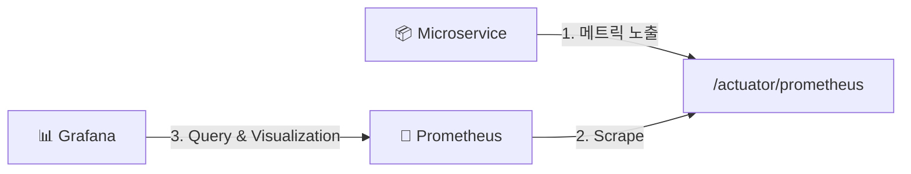
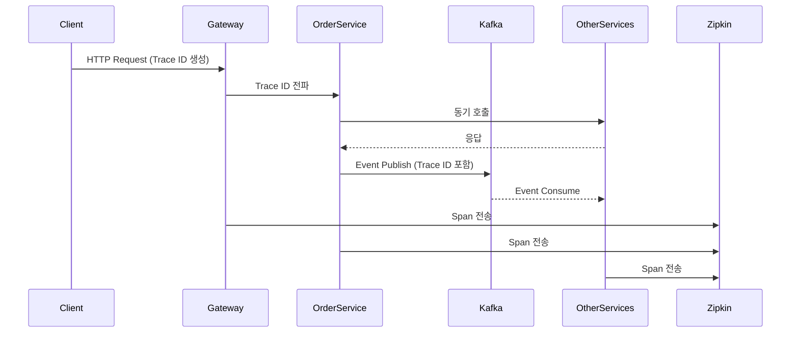
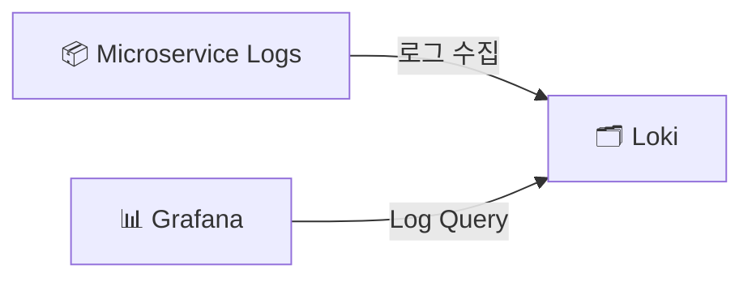
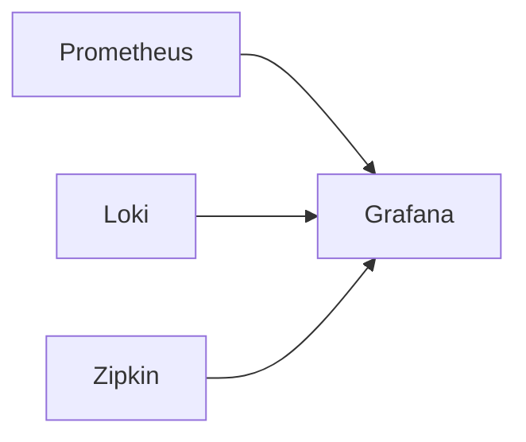

# 📊 Service Monitoring Structure

    마이크로서비스 환경에서 서비스 메트릭, 로그, 분산 추적을 통합 관측하기 위해 **Prometheus**, **Micrometer**, **Loki**, **Zipkin**, **Grafana** 기반의 모니터링 환경을 구축하였습니다.

    각 서비스는 Micrometer를 통해 메트릭을 수집하고, Prometheus가 이를 스크랩 하여 저장합니다.
    로그는 Loki로 중앙 수집 되며, 분산 추적 정보는 Zipkin을 통해 관리됩니다.
    최종적으로 Grafana 대시보드를 통해 모든 데이터를 통합 시각화 하여 운영 환경에서 장애 원인 분석 및 성능 모니터링이 가능하도록 구성했습니다.

## 1. 메트릭 모니터링 (Prometheus + Micrometer)

  각 마이크로 서비스는 **Micrometer**를 통해 JVM, HTTP 요청, DB 커넥션 등의 메트릭을 노출합니다.  
  **Prometheus**는 일정 주기로 각 서비스의 `/actuator/prometheus` 엔드포인트를 스크랩하여 시계열 데이터로 저장합니다.

### 메트릭 수집 흐름

## 2. 분산 추적 (Zipkin)

    마이크로 서비스 간 호출 흐름을 추적하기 위해 **Zipkin**을 도입했습니다.
    각 서비스는 Trace ID 기반으로 요청 흐름을 전파해 장애 발생시 어느 구간에서 지연이 발생했는지 추적할 수 있도록 구성했습니다.

    HTTP 동기 호출과 Kafka 기반 비동기 이벤트 흐름 모두 Trace Context를 전파하여, 주문 요청부터 Saga 처리까지 하나의 Trace로 연결되도록 구성했습니다.

### 분산 추적 흐름

## 3. 로깅 중앙화 (Loki)

    분산된 서비스 로그를 중앙에서 관리하기 위해 **Loki**를 구축했습니다.
    각 서비스 로그는 Loki로 수집되며, Grafana에서 모니터링 합니다.

### 로그 수집 구조

## 4. 시각화 (Grafana)

    **Grafana**를 통해 메트릭, 로그, 분산 추적 데이터를 통합적으로 시각화 했습니다.
    단일 대시보드에서 시스템의 상태를 확인할 수 있도록 구성하여 운영 가시성을 높였습니다.

### 통합 관측 구조

  

