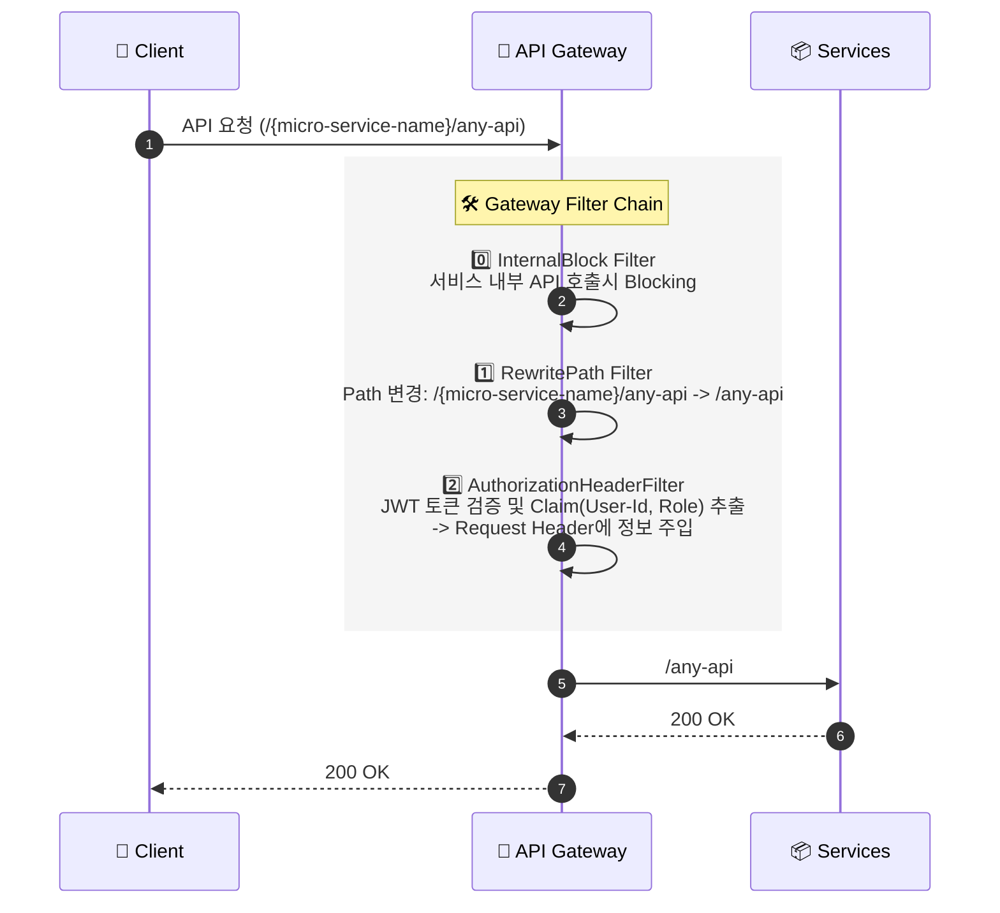

# 🚪 API Gateway Service

<div class="base-text">
**Spring Cloud Gateway** 를 기반으로 전체 시스템의 **단일 진입점**입니다.
클라이언트의 요청을 받아 인증/인가를 수행하고 로드 밸런싱을 통해 각 마이크로 서비스로 요청을 라우팅 합니다.
</div>

## 🛠️ 기술 스택
<div style={{display: 'flex', gap: '8px', marginBottom: '20px'}}>
  
  
  
</div>

---

## 아키텍쳐 및 동작 원리

<div class="base-text">
    Spring Cloud Gateway(SCG)는 **Netty 기반의 Non-Blocking I/O**구조로 동작하며 적은 수의 쓰레드로 많은 동시 요청을 처리할 수 있습니다.
    기존의 **Spring MVC(Tomcat 기반)** 방식과 비교하여 더 높은 동시 처리량을 제공합니다.
</div>

<br/>

### 요청 처리 흐름 (Request Flow)

클라이언트의 요청이 마이크로 서비스로 도달하기까지 **Gateway Filter Chain**을 거치며 다음과 같은 전처리 작업을 수행합니다.

### 시퀀스 다이어그램



### 주요 필터 로직 설명

#### 0. **Internal Block Filter**
- 마이크로서비스 간 내부 통신에만 사용되는 `/internal/**` API 가 외부 클라이언트에 노출되지 않도록 **Global Filter**를 구현했습니다.
- 해당 필터를 가장 **우선 실행 되도록 설정** 하여 `/internal/**` 경로 요청을 감지하면 즉시 요청을 차단합니다.
- 차단시 `404 Not Found`를 반환하여 실제 **리소스 존재 여부**가 외부에 노출되지 않도록 설계하였습니다.

#### 1. **RewritePath Filter**
- 클라이언트는 `/user-service/login` 과 같이 **서비스 식별자를 포함한 경로**로 요청합니다
- Spring Cloud Gateway에서 **RewritePath 필터**를 사용해 **Prefix(`/user-service`)를 제거**한 뒤 `/login` 경로로 내부 서비스에 전달합니다.
- 이를 통해 **외부 접근 경로**와 **내부 서비스**의 API 경로를 분리하여 내부 서비스 **라우팅 의존성**을 제거했습니다.

#### 2. **AuthorizationHeaderFilter**
- 인증이 필수인 API와 **비회원 조회**와 같은 인증이 필요하지 않은 API도 처리할 수 있는 인증 필터를 적용하였습니다.
  - **Authorization 헤더 없음**
    -> 비회원 요청으로 간주하고 필터를 그대로 통과시킵니다.
  - **Authorization 헤더 존재 & 유효한 JWT**
    -> 토큰을 검증한 뒤, 사용자 식별 정보를 **X-User-Id, X-User-Role** 커스텀 헤더에 주입하여 내부 서비스가 인증 정보를 활용할 수 있도록 전달합니다.
  - **Authorization 헤더 존재 & 유효하지 않은 JWT**
    -> 명시적으로 `401 Unauthorized` 응답을 반환하여 잘못된 인증 요청을 차단합니다.

**인증이 필요한 요청과 비회원 요청**을 동일한 Gateway 경로에서 유연하게 처리할 수 있도록 설계 하였습니다.

### 💻 핵심 구현 코드
<div class="base-text">
 Spring Cloud Gateway는 WebFlux 기반으로 동작하므로, 필터 구현 시 블로킹 방식을 사용하지 않고 **Mono 체인 내에서 ServerWebExchange를
 수정하여 헤더 주입 및 요청 처리를 수행**하도록 구현했습니다.
</div>

#### 🔹InternalBlockFilter (내부 API 호출 차단)
가장 먼저 실행되는 필터로 내부 API 접근시 `404` 상태코드를 반환하고 종료합니다
```java
@Override
public Mono<Void> filter(ServerWebExchange exchange, GatewayFilterChain chain) {
    String path = exchange.getRequest().getURI().getPath();
    // /internal/**  내부 api로 요청이 오면 notFound 반환
    if (path.contains("/internal/")) {
        exchange.getResponse().setStatusCode(HttpStatus.NOT_FOUND);
        return exchange.getResponse().setComplete();
    }

    return chain.filter(exchange);
}
```
#### 🔹AuthorizationHeaderFilter (JWT 인증 및 커스텀 헤더 설정)
JWT 에서 추출한 유저 정보를 마이크로 서비스가 사용할 수 있도록 Request Header(X-User-Id, X-User-Role)에 주입합니다.
```java
@Override
public GatewayFilter apply(Config config) {
    return (exchange, chain) -> {
        ServerHttpRequest request = exchange.getRequest();
        //인증 헤더가 없으면 통과
        if (!request.getHeaders().containsKey(HttpHeaders.AUTHORIZATION)) {
            return chain.filter(exchange);
        }
        String authHeader = request.getHeaders().getFirst(HttpHeaders.AUTHORIZATION);
        //인증 헤더 Prefix 검증
        if (!StringUtils.hasText(authHeader) || !authHeader.startsWith(BEARER_PREFIX)) {
            return onError(exchange, "Authorization header must start with Bearer");
        }

        String token = authHeader.substring(BEARER_PREFIX.length());
        log.error("token : {}", token);
        try {
            //JWT 토큰 검증
            Claims claims = jwtParser.parseSignedClaims(token).getPayload();
            //커스텀 헤더에 유저 정보 추가
            ServerHttpRequest mutatedRequest = mutateRequestWithClaims(request, claims);
            return chain.filter(exchange.mutate().request(mutatedRequest).build());
        } catch (Exception e) {
            log.warn("JWT 검증 실패: {}", e.getMessage());
            return onError(exchange, "유효하지 않은 JWT 토큰입니다.");
        }
    };
}
```

### ⚙️ 라우팅 설정
<div class="base-text">
  구현한 필터는 `Config-Service`의 설정 파일을 통해 라우팅 규칙이 적용됩니다.
  `Eureka Naming Service` 와 연동된 `lb://` 를 사용해 **동적 로드 밸런싱**을 수행합니다.
</div>

#### 설정 파일
```yml
spring:
  cloud:
    gateway:
      routes:
        ## ...
        - id: user-service-default
          uri: lb://USER-SERVICE
          predicates:
            - Path=/user-service/**
          filters:
            - RewritePath=/user-service/(?<segment>.*),/${segment}
            - RemoveRequestHeader=X-User-Id
            - RemoveRequestHeader=X-User-Role
            - AuthorizationHeaderFilter
        ## ...
```