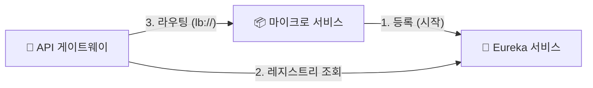
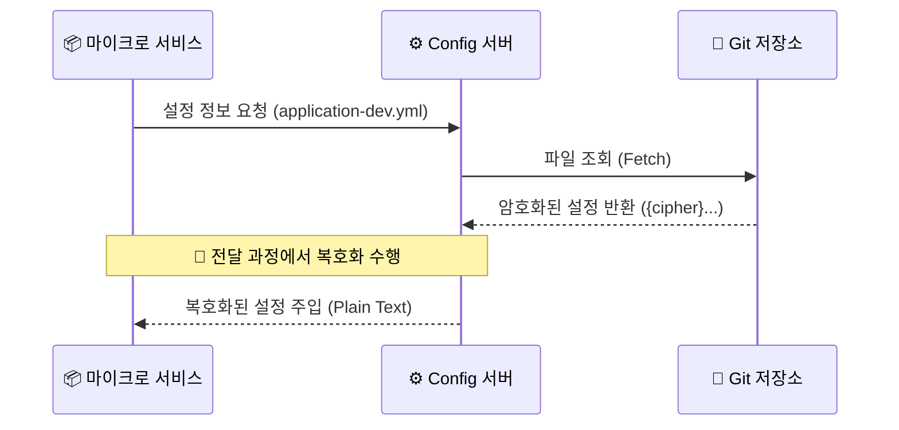

# 🏗️ Service Infrastructure

  마이크로서비스 환경에서 서비스의 위치와 설정을 효율적으로 관리하기 위해
  **Service Discovery(Eureka)** 와 **Centralized Configuration(Spring Cloud Config)** 을 구축했습니다.
  각 서비스 실행시 **Eureka** 에 등록되어 동적으로 관리되며, **Gateway**와 다른 서비스들은 서비스 이름 기반으로 통신하도록 구성했습니다.
  또한 설정 파일을 Config Server에서 중앙 관리하도록 하여 환경별 설정을 분리하고,
  민감한 설정 정보(DB 비밀번호, API 시크릿 키 등)를 **Config Encrypt**를 사용하여 암호화된 형태로 저장하도록 구성하여 보안을 강화했습니다.
  이를 통해 환경별 설정을 분리하고 운영 복잡도를 줄였습니다.

## 1. Service Discovery (Eureka)

각 마이크로 서비스의 IP와 포트 정보를 저장하고, **Gateway가 이를 조회하여 로드 밸런싱**을 할 수 있도록 돕는 레지스트리 서버 입니다.

### 🔄 서비스 등록 및 검색 흐름

## 2. Config Server

  분산된 마이크로 서비스들의 설정파일을 **Git Repository**에서 중앙 관리합니다.

### 구성 아키텍처
- **Centralized Management**: 서비스 재배포 없이 설정 변경 사항을 반영합니다
- **Security**: DB 비밀번호와 같은 민감 정보는 **Encrypt**를 사용하여 암호화 된 상태로 저장소에 올리고 런타임시 복호화 하여 사용합니다

