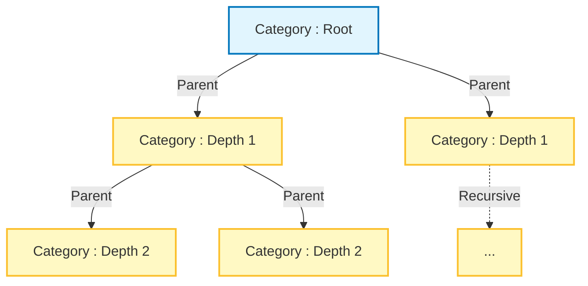
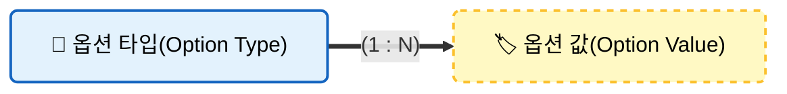
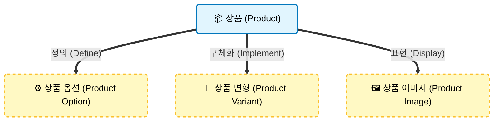
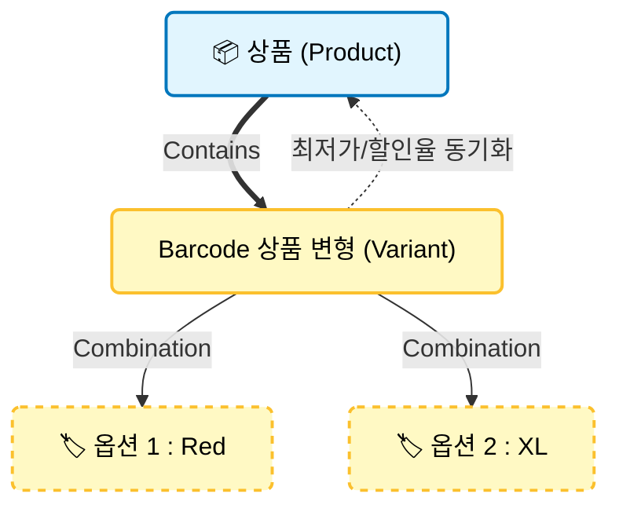
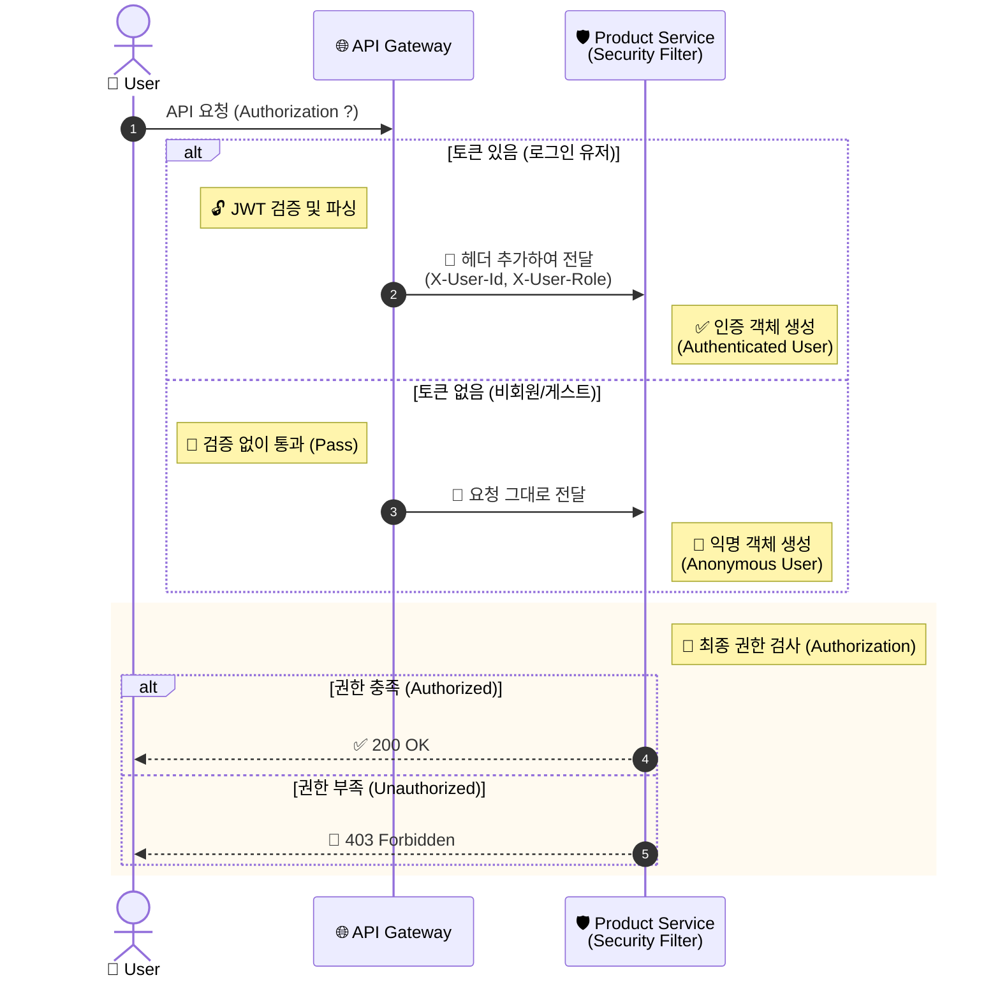

# 📦 Product Service

<div class="base-text">
  **상품 도메인**을 담당하는 마이크로 서비스입니다.
  카테고리, 상품, 상품 옵션, 상품 변형 등 핵심 도메인을 관리하며 상품 조회 및 검색을 위한 API를 제공합니다.

  또한 주문 서비스 등 다른 서비스와의 연동을 위해 
  **Internal API**를 제공하며, 서비스간의 결합도를 낮추기 위해 이벤트 기반 구조(Kafka)를 고려한 설계를 적용하였습니다.
</div>

## 🛠️ 기술 스택

<div style={{display: 'flex', gap: '8px', marginBottom: '30px'}}>
  
  
  
  
  
  
</div>

---

## 🏗️ 주요 기능 및 아키텍처

상품 서비스의 주요 도메인은 **Category(상품 카테고리)**, **옵션(상품 옵션)**, **상품**, **상품 변형** 등이 있습니다.

### 1. 카테고리
<div class="base-text">
  상품 카테고리는 **상품을 분류**하기 위한 도메인으로,
  **자기 참조** 기반의 **계층형 트리 구조**로 설계되어있습니다.
  각 카테고리는 여러개의 **하위 카테고리**를 가질 수 있으며 카테고리의 최대 깊이는 5단계로 제한하여 과도한 계층 생성을 방지합니다.
  
  카테고리는 사용자 화면 구성을 고려해 **트리구조 조회**와 **네비게이션 구조 조회**를 지원합니다.
  또한 **데이터 정합성**을 보장하기 위해 다음과 같은 **제약조건**이 적용됩니다.
  - **동일한 부모** 카테고리 내에서는 **중복된 이름**을 허용하지 않음
  - **자기 자신**을 부모로 설정할 수 없음
  - 자신의 **하위 카테고리**를 부모로 설정할 수 없음
</div>



### 2. 옵션 
<div class="base-text">
  상품 옵션은 **상품의 다양한 구성**(예: 사이즈, 색상)등을 표현하기 위한 도메인으로,
  **옵션 타입(Option Type)** 과 **옵션 값(Option Value)** 구조로 설계되어있습니다.

  옵션 타입은 상품과 연관되어 해당 상품이 가질수 있는 **옵션의 종류**를 정의하며,
  옵션 값은 상품 변형(Product Variant)과 연관되어 실제 선택 가능한 **옵션 값**을 구성합니다.

  이를 통해 하나의 상품에 대해 다양한 조합의 상품 변형을 유연하게 구성할 수 있도록 설계하였습니다.
  또한 데이터 정합성을 보장하기 위해 다음과 같은 **제약 조건**을 적용했습니다.
  - 옵션 타입은 중복된 이름을 가질 수 없음.
  - 동일한 옵션 타입에 속한 옵션 값은 중복된 이름을 가질 수 없음
</div>



### 3. 상품
<div class="base-text">
  상품 도메인은 **상품**의 중심 도메인으로 **상품 이미지**, **상품 옵션**, **상품 변형**으로 구성됩니다.
  하나의 상품은 여러개의 **상품 변형**을 가질 수 있으며 **실제 판매 단위는 상품 변형**을 기준으로 관리됩니다.

  상품 등록 및 판매를 위한 비지니스 흐름은 다음과 같이 설계하였습니다.
  - 상품 생성 -> 상품 옵션 정의 -> 상품 변형 추가 및 상품 이미지 등록 -> 판매 개시
  
  상품은 **최대 3개**까지의 옵션 타입을 가질 수 있으며, **옵션이 없는 상품**도 생성 가능합니다.
  또한 도메인 규칙을 통해 다음과 같은 제약을 적용했습니다.
  - 판매 중인 상품은 옵션을 재설정 할 수 없으며, 판매 중지 상태에서만 가능.
  - 동일한 옵션 타입을 중복으로 설정할 수 없음
  - 상품 변형이 존재하는 경우 상품 변형을 제거한 뒤 옵션 재설정 가능
 
  또한 데이터 정합성과 판매 가능한 상품 상태를 보장하기 위해 다음과 같은 판매 개시 **조건을 검증**합니다.
  - 삭제된 상품은 판매 개시할 수 없음.
  - 상품 변형이 존재하지 않는 경우 판매 개시 할 수 없음
  - 대표 이미지가 없는 경우 판매 개시할 수 없음
</div>



### 4. 상품 변형
<div class="base-text">
  **상품 변형(Product Variant)** 은 상품 판매단위의 도메인으로 상품 가격과 할인율, 재고 등의 정보를 관리합니다.

  상품 변형이 추가되거나 변경될 경우, 상품이 가진 변형중 **최저 판매가격**과 최대 할인율의 상품 변형 정보로 상품 엔티티의 요약 정보가 함께 갱신되도록 구성하여
  상품 목록조회시 성능을 고려한 데이터를 제공합니다.

  또한 도메인 정합성을 보장하기 위해 다음과 같은 제약을 적용했습니다.
  - 상품 변형은 상품이 가지는 옵션과 동일한 수의 옵션을 가져야 함
  - 옵션 값은 해당 상품에 설정된 옵션 타입에 속한 값으로만 제한됨
</div>



### 5. 인증 및 권한 검사
<div class="base-text">
  상품 등록, 수정, 삭제와 같이 권한이 필요한 API에 대해
  **Spring Security**기반의 **인증 및 인가** 처리가 적용됩니다.

  인증은 **API Gateway** 에서 수행되며 **커스텀 헤더 (`X-User-Id`, `X-User-Role`)** 형태로 넘어온 유저 정보를 기반으로 요청 사용자 인증 여부와 권한을 검증합니다.
</div>



---

## 💻 핵심 구현 코드

### 1. 카테고리 경로 자동 관리
계층형 구조인 카테고리 이동시, 자신 뿐 아니라 **모든 하위 자식 경로(path)** 경로까지 재귀적으로 갱신합니다

```java
@Entity
@NoArgsConstructor(access = AccessLevel.PROTECTED)
@Getter
public class Category extends BaseEntity {
  ...
  public void moveParent(Category newParent){
      validateMove(newParent);
      // 연관관계 매핑
      if (this.parent != null) {
          this.parent.getChildren().remove(this);
      }
      this.parent = newParent;

      if (newParent != null) {
          // depth 최신화
          newParent.getChildren().add(this);
          this.depth = newParent.getNextDepth();
      } else {
          // 루트라면 depth 는 1
          this.depth = ROOT_DEPTH;
      }
      // 자신 경로 최신화
      generatePath();
      // 자식 경로 최신화
      updateChildrenPath(this.children);
  }
  
  private void updateChildrenPath(List<Category> children) {
    if (children == null || children.isEmpty()) {
      return;
    }

    for (Category child : children) {
      child.depth = generateDepth(child.getParent());
      child.generatePath();

      updateChildrenPath(child.getChildren());
    }
  }
  ...
```

### 2. QueryDsl을 활용한 동적 검색
카테고리, 상품명 등 다양한 필터링 조건이 조합되는 **검색 기능**을 유연하게 처리하기 위해 **BooleanExpression**을 활용하여 쿼리의 **가독성과 재사용성**을 높였습니다.
```java
@Override
public Page<Product> findProductsByCondition(ProductSearchCondition condition) {
    Pageable pageable = condition.getPageable();
    OrderSpecifier<?> sortOrder = ProductQueryMapper.toOrderSpecifier(condition.getSort());
    List<Product> result = factory.select(product)
            .from(product)
            .join(product.category, category).fetchJoin()
            .where(eqCategory(condition.getCategoryId()),
                    containName(condition.getName()),
                    filterRating(condition.getRating()),
                    product.status.eq(ProductStatus.ON_SALE))
            .offset(pageable.getOffset())
            .limit(pageable.getPageSize())
            .orderBy(sortOrder, product.id.desc())
            .fetch();

    Long totalElement = factory.select(product.countDistinct())
            .from(product)
            .join(product.category, category)
            .where(eqCategory(condition.getCategoryId()),
                    containName(condition.getName()),
                    filterRating(condition.getRating()),
                    product.status.eq(ProductStatus.ON_SALE))
            .fetchOne();

    return new PageImpl<>(
            result,
            pageable,
            totalElement != null ? totalElement : 0L
    );
}
```

### 3. Saga 재고 감소
**주문 생성 이벤트** 발행시 Kafka 리스너를 통해 비동기적으로 **재고 감소**를 처리하며, 처리 결과에 따라 성공,실패 이벤트를 다시 발행해 **데이터 일관성**을 유지합니다.
또한 롤백 이벤트시에도 비동기적으로 재고 복구를 처리합니다.
```java
@Service
@RequiredArgsConstructor
@Slf4j
public class SagaProcessor {
    private final VariantService variantService;
    private final SagaEventProducer sagaEventProducer;

    public void productSagaProcess(ProductSagaCommand command) {
        try {
            List<VariantStockCommand> stockCommands = mapToStockCommand(command);
            processStockCommand(command.getType(), stockCommands);
            sagaEventProducer.sendSagaSuccess(command.getSagaId(), command.getOrderNo());
        } catch (BusinessException e) {
            handleException(command, e.getErrorCode().name(), e.getMessage());
        } catch (Exception e) {
            handleException(command, "SYSTEM_ERROR", "시스템 오류");
        }
    }

    private void processStockCommand(ProductCommandType type, List<VariantStockCommand> commands) {
        switch (type) {
            case DEDUCT_STOCK -> variantService.deductVariantsStock(commands);
            case RESTORE_STOCK -> variantService.restoreVariantsStock(commands);
        }
    }

    private List<VariantStockCommand> mapToStockCommand(ProductSagaCommand command) {
        return command.getItems().stream().map(item -> VariantStockCommand.of(item.getProductVariantId(), item.getQuantity()))
                .toList();
    }

    private void handleException(ProductSagaCommand command, String code, String message) {
        if (command.getType() == ProductCommandType.RESTORE_STOCK) {
            log.error("🚨 재고 복구 실패! 재시도 필요. SagaID: {}", command.getSagaId());
            throw new RuntimeException("재고 복구 실패 - 재시도 요망");
        }

        log.warn("재고 차감 실패. SagaID: {}", command.getSagaId());
        sagaEventProducer.sendSagaFailure(command.getSagaId(), command.getOrderNo(), code, message);
    }
}
```

## 🗄️ 데이터 모델 
Product 서비스는 Database per Service 패턴을 따르며, 독립적인 데이터베이스를 가집니다.

### 📊 ER Diagram

<div style={{ display: 'flex', justifyContent: 'center' }}>
  
</div>


## ✅ 테스트 커버리지

**테스트 커버리지** : 96%

<div style={{ display: 'flex', justifyContent: 'center' }}>
  
</div>
