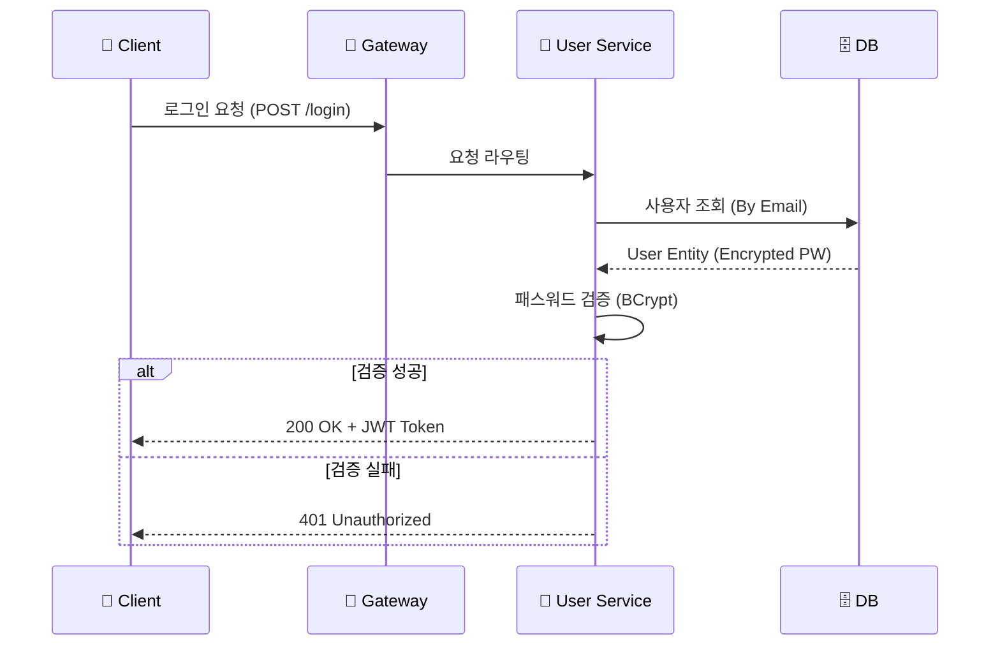
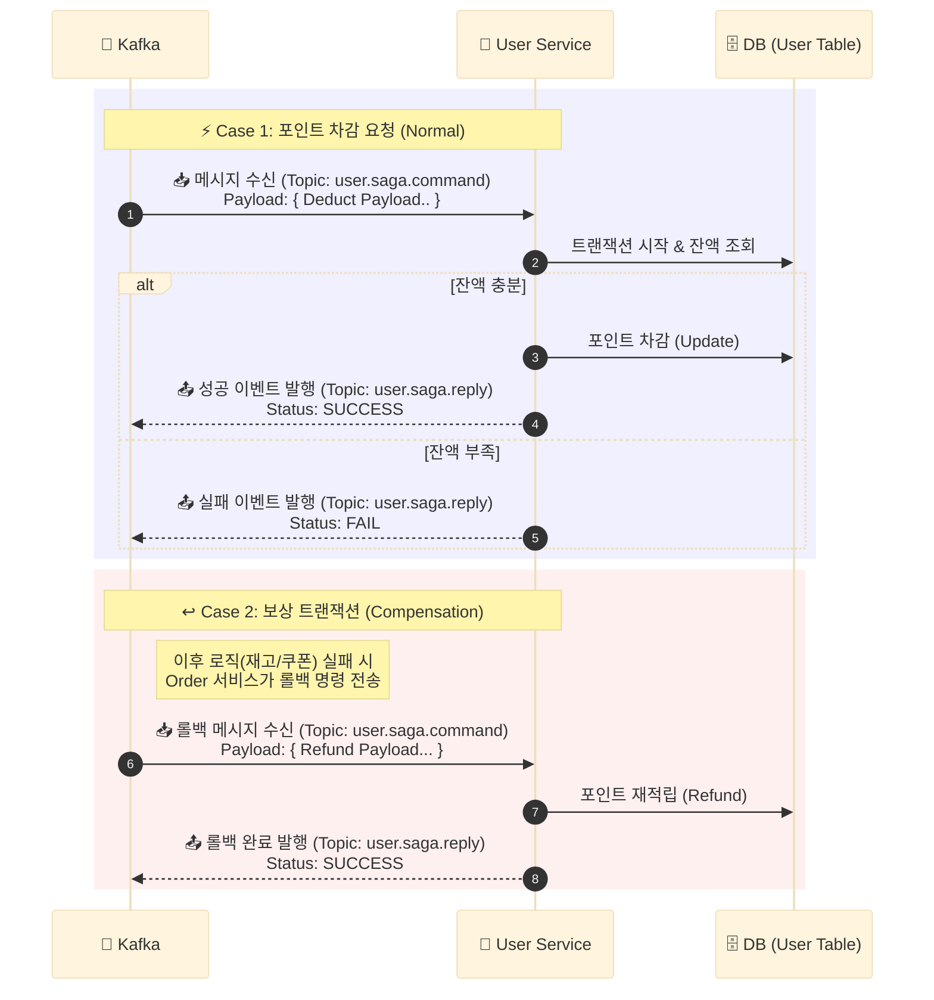
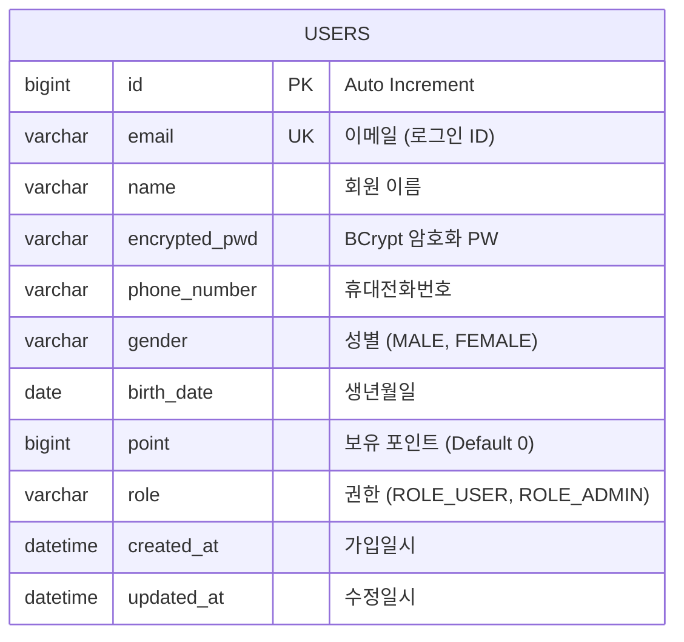

# 👤 User Service

<div class="base-text">
  **회원 도메인** 을 담당하는 마이크로 서비스입니다.
  사용자 회원가입 및 로그인과 같은 인증 기능을 처리하며, JWT 기반의 인증/인가를 제공합니다. 
  또한 주문 서비스와의 연동을 위한 **Internal API**를 제공하고 주문 이벤트를 소비하여 포인트 적립 및 차감을 처리하는  
  **Kafka Consumer 기반의 비동기 처리 로직**을 포함하고 있습니다.
</div>

## 🛠️ 기술 스택
<div style={{display: 'flex', gap: '8px', marginBottom: '20px'}}>
  
  
  
  
  
  
</div>

## 🏗️ 주요 기능 및 아키텍처

UserService는 크게 **외부 사용자 요청(인증)**, **내부 시스템 요청(Internal)**, **(비동기 이벤트 처리(Saga))** 세 가지 흐름으로 동작합니다.

### 1. 인증 및 회원 관리 (Authentication)
사용자의 회원가입 및 로그인을 처리합니다. 비밀번호는 **BCrypt** 알고리즘으로 암호화되어 저장되며, 로그인 성공시 **JWT 토큰** 생성하고 **Redis** 저장소에 RefreshToken을 저장한 뒤 AccessToken, RefreshToken을 반환합니다.


### 2. Internal API
주문 서비스 등 다른 마이크로 서비스에서 사용자 정보를 동기적으로 조회해야할때 사용합니다.
- **보안**: `/internal/**` 경로는 Gateway의 InternalBlockFilter에 의해 외부 접근이 차단되어 외부에서 호출될 수 없습니다.
- **주요 API** : `/{userId}/order-info`: 주문시 회원 정보와 현재 포인트 잔액을 확인합니다.

### 3. Saga 패턴 & 포인트 처리
주문 시스템의 Saga 패턴에 참여하여, 주문 생성시 포인트를 차감하는 역할을 수행합니다.


## 💻 핵심 구현 코드

### 1. 로그인 토큰 생성
회원 검증을 수행하고 토큰 생성후 **Redis**에 리프레시 토큰을 저장한 뒤 **AccessToken**은 응답 바디, **RefreshToken**은 쿠키에 저장되어 응답이 반환됩니다.

```java
public TokenData login(String email, String password) {
    User user = findByEmailOrThrow(email);
    // 비밀번호 일치 확인
    validatePassword(password, user.getEncryptedPwd());
    // 토큰 (AccessToken, RefreshToken) 생성
    TokenData tokenData = tokenGenerator.generateTokenData(user.getId(), user.getRole());
    // Refresh Token 저장
    RefreshToken refreshToken = RefreshToken.create(user.getId(), tokenData.getRefreshToken());
    tokenRepository.save(refreshToken, tokenGenerator.getRefreshTokenExpiration());
    return tokenData;
}
```

### 2. Internal API
주문시 사용자 정보를 조회하기 위한 **내부 API** 입니다.
회원 기본정보(이름, 전화번호 등), 포인트 잔액을 반환합니다.
```java
@RestController
@RequestMapping("/internal/users")
@RequiredArgsConstructor
public class InternalUserController {

    private final UserService userService;

    @GetMapping("/{userId}/order-info")
    public ResponseEntity<UserOrderResponse> getUserInfoForOrder(@PathVariable("userId") Long userId){
        UserOrderResponse response = userService.getUserInfoForOrder(userId);
        return ResponseEntity.ok(response);
    }
}
```

### 3. Saga 포인트 차감
주문 생성 이벤트 발행시 **Kafka 리스너**를 통해 비동기적으로 포인트 차감 요청을 처리하며, 처리 결과에 따라 성공,실패 이벤트를 다시 발행해 데이터 일관성을 유지합니다.
또한 롤백 이벤트시에도 비동기적으로 포인트 복구를 처리합니다.
```java
@Component
@RequiredArgsConstructor
@Slf4j
public class SagaProcessor {
    private final UserService userService;
    private final SagaEventProducer sagaEventProducer;

    public void userSagaProcess(UserSagaCommand command) {
        try {
            // 포인트 처리 성공 이벤트 발행
            processPointCommand(command.getType(), command.getUserId(), command.getUsedPoint());
            sagaEventProducer.sendSagaSuccess(command.getSagaId(), command.getOrderNo());
        } catch (BusinessException e) { // 포인트 처리 실패시 
            handleException(command, e.getErrorCode().name(), e.getMessage());
        } catch (Exception e) {
            handleException(command, "SYSTEM_ERROR", "시스템 오류");
        }
    }
    ...
}
```

## 🗄️ 데이터 모델 (Data Model)

User 서비스는 **Database per Service** 패턴을 따르며, 독립적인 데이터베이스(`users`)를 가집니다.


# 향후 개선 계획
- [] Refresh 토큰을 사용한 토큰 재발급
- [] 사용자 도메인 API 추가