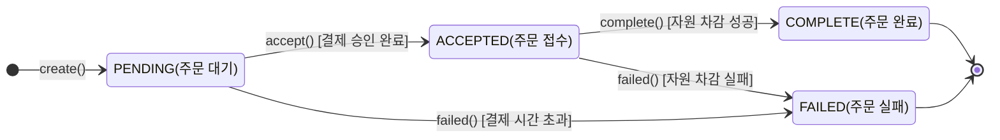
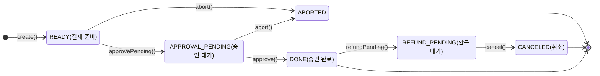
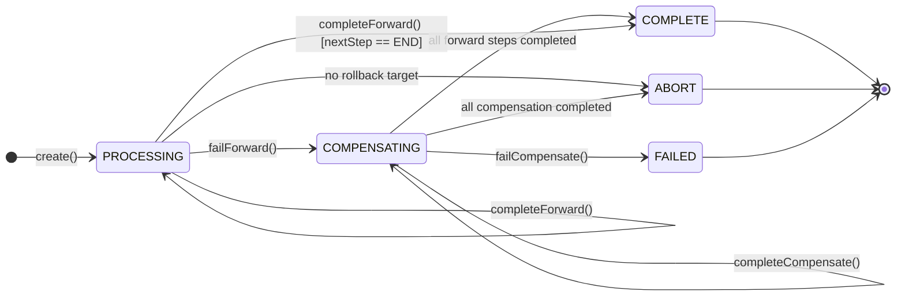

# [주문 애플리케이션 서비스] 도메인 모델 명세서

> 본 문서는 `주문 서비스`의 비지니스 요구 사항을 해결하기 위한 도메인 객체 구조, 역할, 핵심 비지니스 규칙을 정의한다.

## 1. 개요 (Overview)

- **도메인 목적**: 사용자의 장바구니, 주문서, 최종 주문 생성 및 결제 후 SAGA 까지의 전체 주문 흐름을 관리한다.
- **주요 아키텍처 패턴**: `Domain-Driven Design`, `Hexagonal Architecture`, `SAGA pattern`

## 2. 애그리거트 명세 (Aggregate Specifications)

### 2.1 장바구니 (`Cart`- Aggregate Root)

사용자의 주문 대기중인 상품 목록을 관리

### 2.1.1 속성 (Attribute)

| 필드명         | 타입               | 설명                    |
|-------------|------------------|-----------------------|
| `id`        | `Long`           | 장바구니 식별자              |
| `userId`    | `Long`           | 장바구니의 소유자 식별자         |
| `cartItems` | `List<CartItem>` | 장바구니에 담긴 개별 상품 항목 리스트 |

### 2.1.2 핵심 도메인 규칙 (Invariants / Business Rules)

- [규칙 1: 사용자 1명당 1개의 장바구니를 갖는다.]
    1. 장바구니 생성시 `userId`는 반드시 존재해야 한다.
- [규칙 2: 장바구니에 상품을 추가할 때 최소 1개 이상의 항목이 전달 되어야 한다.]
    1. `addItems(장바구니 항목 추가)` 호출 시 추가할 상품 목록이 비어있으면 장바구니 항목을 추가할 수 없다.
- [규칙 3: 장바구니 항목 수는 최대 20개를 초과할 수 없다.]
    1. 새로운 상품을 추가할 때 현재 장바구니 항목 수가 20개 이상이면 추가할 수 없다.
- [규칙 4: 동일한 옵션의 상품은 장바구니에 중복된 항목으로 추가되지 않는다.]
    1. 동일한 `productVariantId(상품 판매 단위 식별자)`의 상품이 이미 존재하면 새로운 항목을 생성하지 않고 기존 항목의 수량을 증가시킨다.
- [규칙 5: 장바구니 항목을 수정하거나 삭제할 때 해당 장바구니에 존재하는 항목만 대상이 될 수 있다.]
    1. 존재하지 않는 `cartItemId(장바구니 항목 아이디)`로 수량을 변경하거나 삭제할 수 없다.

### 2.1.3 주요 행위 (Behavior / Commands)

| 메서드명/행위              | 파라미터                                 | 반환값              | 비지니스 의도 및 제약                                                                                                                          |
|----------------------|--------------------------------------|------------------|---------------------------------------------------------------------------------------------------------------------------------------|
| `create`             | `userId`, `IdGenerator`              | `Cart`           | 특정 사용자의 장바구니를 생성한다.                                                                                                                   |
| `addItems`           | `AddCartItemsContext`, `IdGenerator` | `List<CartItem>` | 여러 상품을 장바구니에 추가한다. 추가할 항목이 비어있으면 안되며, 각 항목은 장바구니의 최대 항목수 제한을 준수해야한다. 동일한 `productVariantId` 가 이미 존재하면 새 항목을 생성하지 않고 기존 항목의 수량을 증가시킨다. |
| `updateItemQuantity` | `UpdateCartItemContext`              | `void`           | 장바구니에 존재하는 항목의 수량을 변경한다.                                                                                                              |
| `deleteItem`         | `cartItemId`                         | `void`           | 장바구니에 존재하는 항목을 제거한다.                                                                                                                  |

### 2.1.4 내부 구성 요소(Entities & Value Objects)

#### 하위 엔티티: 장바구니 항목 (`CartItem`)

**역할**: 장바구니에 담긴 개별 상품 정보를 관리 한다.

**속성 (Attribute)**

| 필드명                | 타입        | 설명          |
|--------------------|-----------|-------------|
| `id`               | `Long`    | 장바구니 항목 아이디 |
| `cart`             | `Cart`    | 장바구니        |
| `productVariantId` | `Long`    | 상품 변형 아이디   |
| `quantity`         | `Integer` | 담은 수량       |

**도메인 규칙**

- [규칙 1: 상품 수량은 최소 1개 이상이어야 한다.]
    1. `CartItem` 생성 및 수량 변경 시 수량이 0 이하면 생성 또는 변경할 수 없다.
- [규칙 2: 상품 수량은 상품별 최대 구매 수량을 초과할 수 없다.]
    1. `CartItem` 생성, 기존 수량 증가, 수량 변경 시 지정된 `maxLimit`를 초과할 수 없다.
- [규칙 3: 수량 증가 후에도 최대 구매 수량 제한을 초과할 수 없다.]
    1. 기존 수량에 추가 수량을 더한 값이 `maxLimit`를 초과하면 수량을 증가시킬 수 없다.

**주요 행위**

| 메서드명/행위          | 파라미터                                      | 반환값        | 비지니스 의도 및 제약                                                                  |
|------------------|-------------------------------------------|------------|-------------------------------------------------------------------------------|
| `create`         | `AddCartItemsContext.Item`, `IdGenerator` | `CartItem` | 상품 변형과 수량을 기반으로 장바구니 항목을 생성한다. 식별자를 생성하고, 수량이 1 이상이며 최대 구매 수량을 초과하지 않는지 검증한다. |
| `addQuantity`    | `quantity`, `maxLimit`                    | `void`     | 기존 장바구니 항목의 수량을 증가시킨다. 증가된 최종 수량이 최대 구매 수량을 초과하지 않아야 한다.                      |
| `updateQuantity` | `quantity`, `maxLimit`                    | `void`     | 장바구니 항목의 수량을 새로운 값으로 변경한다. 변경 수량은 1 이상이어야 하며 최대 구매 수량을 초과할 수 없다.              |

---

### 2.2 주문서 (`OrderSheet`- Aggregate Root)

주문 생성 전에 주문에 필요한 상품, 배송지, 쿠폰, 포인트 등의 정보를 하나의 주문 단위로 관리하고, 할인 및 결제 금액을 계산하며 주문서의 유효성을 보장한다.

### 2.2.1 속성 (Attribute)

| 필드명               | 타입                     | 설명                       |
|-------------------|------------------------|--------------------------|
| `id`              | `Long`                 | 주문서 식별자                  |
| `orderer`         | `Orderer`              | 주문자 정보                   |
| `shippingAddress` | `ShippingAddress`      | 배송 정보                    |
| `items`           | `List<OrderSheetItem>` | 주문서에 포함된 상품 항목 목록        |
| `cartCoupon`      | `CartCouponSnapshot`   | 주문서에 적용된 장바구니 쿠폰 정보의 스냅샷 |
| `usedPoints`      | `Money`                | 주문서에서 사용한 포인트            |
| `expiresAt`       | `LocalDateTime`        | 주문서 만료 시각                |

### 2.2.2 핵심 도메인 규칙 (Invariants / Business Rules)

- [규칙 1: 주문서는 하나 이상의 주문 항목을 가져야 한다.]
    1. 주문서 생성시 `items`(주문 항목) 이 비어있으면 주문서를 생성할 수 없다.
- [규칙 2: 주문서 생성 시 사용 포인트는 0으로 시작한다.]
    1. 주문서가 생성되면 `usedPoints`는 `Money.ZERO`로 초기화된다.
- [규칙 3: 사용 포인트는 현재 주문서에서 사용할 수 있는 최대 포인트를 초과할 수 없다.]
    1. 포인트 적용 시 상품 쿠폰 및 장바구니 쿠폰이 반영된 포인트 적용 가능 금액을 기준으로 최대 사용 가능 포인트를 계산하며, 이를 초과한 포인트는 사용할 수 없다.
- [규칙 4: 상품 쿠폰을 적용하면 기존 사용 포인트가 새로운 최대 사용 가능 포인트를 초과하지 않도록 조정한다.]
    1. 상품 쿠폰 적용으로 포인트 사용 가능 금액이 감소한 경우 기존 `usedPoints`가 허용 범위를 초과하면 최대 사용 가능 포인트까지 자동으로 조정한다.
- [규칙 5: 장바구니 쿠폰은 최소 결제 금액 조건을 만족하는 경우에만 적용할 수 있다.]
    1. 주문 항목의 소계가 장바구니 쿠폰의 `minimumPaymentAmount`보다 작으면 장바구니 쿠폰을 적용할 수 없다.
- [규칙 6: 동일한 상품 쿠폰을 여러 주문 항목에 중복 적용할 수 없다.]
    1. 현재 적용하려는 상품 쿠폰이 다른 주문 항목에 이미 적용되어 있다면 다시 적용할 수 없다.
- [규칙 7: 주문서의 사용 포인트는 결제 금액 계산에 반영된다.]
    1. 최종 결제 금액은 상품 할인과 상품 쿠폰 할인, 장바구니 쿠폰 할인을 차감한 금액에서 사용 포인트를 추가로 차감하여 계산한다.
- [규칙 8: 주문서는 만료 시각을 기준으로 만료 여부를 판단한다.]
    1. 현재 시각이 `expiresAt` 이후이면 주문서는 만료된 것으로 판단한다.

### 2.2.3 주요 행위 (Behavior / Commands)

| 메서드명/행위                            | 파라미터                                                            | 반환값          | 비지니스 의도 및 제약                                                                                                                         |
|------------------------------------|-----------------------------------------------------------------|--------------|--------------------------------------------------------------------------------------------------------------------------------------|
| `create`                           | `CreateOrderSheetContext`, `IdGenerator`                        | `OrderSheet` | 주문서를 생성한다. 식별자를 생성하고 주문 항목이 하나 이상 존재하는지 검증한 후 주문 항목을 생성한다. 생성 시 사용 포인트는 0으로 초기화한다.                                                   |
| `changeShippingAddress`            | `ShippingAddress`                                               | `void`       | 주문서의 배송지를 변경한다. 변경할 배송 정보가 반드시 존재해야 한다                                                                                               |
| `applyItemCoupon`                  | `orderSheetItemId`   , `ItemCouponSnapshot`, `PointUsagePolicy` | `void`       | 특정 주문 항목에 상품 쿠폰을 적용한다. 대상 주문 항목이 존재해야 하며, 동일한 상품 쿠폰이 다른 항목에 이미 적용되어 있으면 적용할 수 없다. 쿠폰 적용 후 포인트 사용 한도를 다시 계산하여 기존 사용 포인트를 필요에 따라 조정한다. |
| `applyCartCoupon`                  | `CartCouponSnapshot`, `PointUsagePolicy`                        | `void`       | 주문서 전체에 장바구니 쿠폰을 적용한다. 주문 항목 소계가 쿠폰의 최소 결제 금액 조건을 만족해야 하며, 적용 후 포인트 사용 한도를 다시 계산한다.                                                  |
| `applyPoints`                      | `Money`, `PointUsagePolicy`                                     | `void`       | 주문서에서 사용할 포인트를 설정한다. 요청한 포인트가 현재 주문서의 최대 사용 가능 포인트를 초과하면 적용할 수 없다.                                                                   |
| `calculateMaxUsablePoints`         | `PointUsagePolicy`                                              | `Money`      | 상품 쿠폰과 장바구니 쿠폰이 적용된 최종 금액을 기준으로 주문서에서 사용할 수 있는 최대 포인트를 계산한다.                                                                         |
| `calculateCartCouponDiscount`      | 없음                                                              | `Money`      | 적용된 장바구니 쿠폰의 할인 금액을 계산한다. 쿠폰이 없으면 0원을 반환하며, 할인 금액이 최종 상품 금액을 초과하지 않도록 제한한다.                                                          |
| `calculateTotalOriginalAmount`     | 없음                                                              | `Money`      | 주문 항목의 원래 가격 기준 총 상품 금액을 계산한다.                                                                                                       |
| `calculateTotalItemDiscount`       | 없음                                                              | `Money`      | 주문 항목의 상품 자체 할인 금액 총합을 계산한다.                                                                                                         |
| `calculateTotalItemCouponDiscount` | 없음                                                              | `Money`      | 주문 항목에 적용된 상품 쿠폰 할인 금액의 총합을 계산한다.                                                                                                    |
| `calculateTotalPaymentAmount`      | 없음                                                              | `Money`      | 상품 할인, 상품 쿠폰, 장바구니 쿠폰, 사용 포인트를 모두 반영한 최종 결제 금액을 계산한다.                                                                                |
| `isExpired`                        | `LocalDateTime`, `currentTime`                                  | `boolean`    | 현재 시각이 주문서의 만료 시각 이후인지 판단하여 주문서 만료 여부를 반환한다.                                                                                         |
| `calculateRemainingTtl`            | `LocalDateTime`, `currentTime`                                  | `Duration`   | 현재 시각부터 주문서 만료 시각까지의 남은 유효 시간을 계산한다. 만료된 경우 0을 반환한다.                                                                                 |
| `hasCoupon`                        | 없음                                                              | `boolean`    | 주문서에 장바구니 쿠폰이 적용되어 있는지 확인한다.                                                                                                         |
| `validateCartCouponNotChanged`     | `CartCouponSnapshot`                                            | `void`       | 주문서에 저장된 장바구니 쿠폰과 현재 쿠폰 정보를 비교하여 쿠폰 정책이 변경되지 않았는지 검증한다. 쿠폰 ID가 다르거나 할인 정책 또는 최소 결제 금액이 변경되면 검증에 실패한다.                                |
| `validatePointsLimit`              | `Money`, `PointUsagePolicy`                                     | `void`       | 요청한 포인트가 현재 주문서에서 사용할 수 있는 최대 포인트를 초과하는지 검증한다.                                                                                       |

### 2.2.4 내부 구성 요소(Entities & Value Objects)

#### 하위 엔티티: 주문서 항목 (`OrderSheetItem`)

주문서에 포함된 개별 상품의 가격, 수량, 옵션 및 상품 쿠폰 스냅샷을 관리하고 해당 상품의 할인 금액과 최종 금액을 계산한다.

**속성 (Attribute)**

| 필드명                  | 타입                            | 설명                     |
|----------------------|-------------------------------|------------------------|
| `id`                 | `Long`                        | 주문서 항목 식별자             |
| `productSnapshot`    | `ProductSnapshot`             | 주문 시점의 상품 정보 스냅샷       |
| `priceSnapshot`      | `ProductPriceSnapshot`        | 주문 시점의 상품 가격 정보 스냅샷    |
| `itemCouponSnapshot` | `ItemCouponSnapshot`          | 주문 항목에 적용된 상품 쿠폰 스냅샷   |
| `quantity`           | `int`                         | 주문 상품 수량               |
| `optionSnapshots`    | `List<ProductOptionSnapshot>` | 주문 시점의 상품 옵션 정보 스냅샷 목록 |

**도메인 규칙**

- [규칙 1: 주문 항목의 수량은 1개 이상이어야 한다.]
    1. 주문 항목 생성 시 수량이 0 이하이면 생성할 수 없다.
- [규칙 2: 상품 쿠폰이 적용되지 않은 경우 상품 쿠폰 할인 금액은 0원이다.]
    1. 상품 쿠폰이 존재하지 않으면 `calculateCouponDiscount()`는 0원을 반환한다.
- [규칙 3: 상품 쿠폰 할인 금액은 상품 금액을 초과할 수 없다.]
    1. 계산된 쿠폰 할인 금액이 상품의 할인 가격 총액보다 크더라도 상품 금액을 초과하는 할인은 적용하지 않는다.
- [규칙 4: 상품 쿠폰은 쿠폰 적용 가능 수량까지만 적용된다.]
    1. 상품 쿠폰의 `applyQuantityLimit`과 주문 수량 중 작은 값을 실제 할인 적용 수량으로 사용한다.
- [규칙 5: 주문서에 저장된 상품 가격과 현재 상품 가격이 다르면 가격 변경으로 판단한다.]
    1. 주문 시점의 `priceSnapshot`과 현재 가격 스냅샷이 동일하지 않으면 가격이 변경된 것으로 검증한다.
- [규칙 6: 주문서에 저장된 상품 쿠폰과 현재 상품 쿠폰의 정책이 다르면 쿠폰 정책 변경으로 판단한다.]
    1. 쿠폰 `ID`뿐만 아니라 할인 정책과 적용 가능 수량 제한이 동일한지 검증한다.

**주요 행위**

| 메서드명/행위                          | 파라미터                                         | 반환값              | 비지니스 의도 및 제약                                                                 |
|----------------------------------|----------------------------------------------|------------------|------------------------------------------------------------------------------|
| `create`                         | `CreateOrderSheetItemContext`, `IdGenerator` | `OrderSheetItem` | 주문서 항목을 생성한다. 식별자를 생성하고 상품 수량이 1개 이상인지 검증한 후 주문 시점의 상품·가격·옵션 정보를 스냅샷으로 보관한다. |
| `applyItemCoupon`                | `ItemCouponSnapshot`                         | `void`           | 주문서 항목에 상품 쿠폰을 적용한다. 적용할 쿠폰 정보가 반드시 존재해야 한다.                                 |
| `removeItemCoupon`               | 없음                                           | `void`           | 주문서 항목에 적용된 상품 쿠폰을 제거한다.                                                     |
| `calculateOriginalLineTotal`     | 없음                                           | `Money`          | 원래 상품 가격을 수량만큼 계산하여 해당 주문 항목의 원가 총액을 반환한다.                                   |
| `calculateItemDiscountLineTotal` | 없음                                           | `Money`          | 상품 자체 할인 금액을 수량만큼 계산한다.                                                      |
| `calculateLineTotal`             | 없음                                           | `Money`          | 상품의 할인 적용 가격을 수량만큼 계산하여 쿠폰 적용 전 상품 금액을 반환한다.                                 |
| `calculateCouponDiscount`        | 없음                                           | `Money`          | 적용된 상품 쿠폰의 총 할인 금액을 계산한다. 쿠폰 적용 수량 제한을 반영하며 상품 금액을 초과하는 할인은 허용하지 않는다.        |
| `calculateFinalAmount`           | 없음                                           | `Money`          | 상품 금액에서 상품 쿠폰 할인 금액을 차감하여 해당 항목의 최종 금액을 계산한다.                                |
| `hasCoupon`                      | 없음                                           | `boolean`        | 주문 항목에 상품 쿠폰이 적용되어 있는지 확인한다.                                                 |
| `validatePriceNotChanged`        | `ProductPriceSnapshot`                       | `void`           | 주문 시점의 가격과 현재 가격을 비교하여 가격 변경 여부를 검증한다.                                       |
| `validateItemCouponNotChanged`   | `ItemCouponSnapshot`                         | `void`           | 주문서에 저장된 상품 쿠폰과 현재 쿠폰을 비교하여 쿠폰 ID, 할인 정책, 적용 수량 제한의 변경 여부를 검증한다.             |

#### 값 객체: 장바구니 쿠폰 스냅샷 (`CartCouponSnapshot`)

주문서 작성 시점의 장바구니 쿠폰 정보를 보존하여 이후 쿠폰 정책이 변경되더라도 당시 주문서에 적용된 쿠폰 정보를 기준으로 할인 금액을 계산하고 변경 여부를 검증한다.

**속성 (Attribute)**

| 필드명                    | 타입                     | 설명                 |
|------------------------|------------------------|--------------------|
| `cartCouponId`         | `Long`                 | 장바구니 쿠폰 식별자        |
| `name`                 | `String`               | 장바구니 쿠폰 이름         |
| `discountPolicy`       | `CouponDiscountPolicy` | 쿠폰 할인 정책           |
| `minimumPaymentAmount` | `Money`                | 쿠폰 적용을 위한 최소 결제 금액 |

**도메인 규칙**

- 쿠폰 식별자, 이름, 할인 정책, 최소 결제 금액은 필수이며, 쿠폰은 기준 금액이 최소 결제 금액 이상인 경우에만 적용 가능 하다.

**주요 행위**

| 메서드명/행위             | 파라미터    | 반환값       | 비지니스 의도 및 제약                        |
|---------------------|---------|-----------|-------------------------------------|
| `isSatisfiedBy`     | `Money` | `boolean` | 기준 금액이 쿠폰의 최소 결제 금액 조건을 만족하는지 판단한다. |
| `calculateDiscount` | `Money` | `Money`   | 쿠폰의 할인 정책을 기준으로 할인 금액을 계산한다.        |

#### 값 객체: 상품 쿠폰 스냅샷 (`ItemCouponSnapshot`)

주문서 작성 시점의 상품 쿠폰 정보를 보존하고, 상품 수량과 쿠폰 적용 수량 제한을 기준으로 실제 할인 금액을 계산한다.

**속성 (Attribute)**

| 필드명                  | 타입                     | 설명                    |
|----------------------|------------------------|-----------------------|
| `itemCouponId`       | `Long`                 | 상품 쿠폰 식별자             |
| `name`               | `String`               | 상품 쿠폰 이름              |
| `discountPolicy`     | `CouponDiscountPolicy` | 쿠폰 할인 정책              |
| `applyQuantityLimit` | `Integer`              | 쿠폰을 적용할 수 있는 최대 상품 수량 |

**도메인 규칙**

- 쿠폰 식별자, 이름, 할인 정책, 쿠폰 적용 가능 수량은 필수이며, 할인은 실제 상품 수량과 쿠폰 적용 가능 수량 중 작은 수량에 대해서만 적용 가능 하다.

**주요 행위**

| 메서드명/행위                  | 파라미터           | 반환값     | 비지니스 의도 및 제약                                                                 |
|--------------------------|----------------|---------|------------------------------------------------------------------------------|
| `calculateTotalDiscount` | `Money`, `int` | `Money` | 상품 가격과 주문 수량을 기준으로 상품 쿠폰의 총 할인 금액을 계산한다. 쿠폰 적용 가능 수량을 초과하는 상품 수량에는 할인하지 않는다. |

#### 정책: 포인트 정책 (`PointUsagePolicy`)

주문서의 포인트 적용 가능 금액을 기준으로 주문에 사용할 수 있는 최대 포인트를 계산한다.

**주요 행위**

| 메서드명/행위                    | 파라미터    | 반환값     | 비지니스 의도 및 제약                            |
|----------------------------|---------|---------|-----------------------------------------|
| `calculateAvailablePoints` | `Money` | `Money` | 포인트 적용 대상 금액을 기준으로 사용 가능한 최대 포인트를 계산한다. |

#### 정책: 쿠폰 정책 (`CouponDiscountPolicy`)

쿠폰 스냅샷의 쿠폰 할인 금액을 계산한다.

**주요 행위**

| 메서드명/행위             | 파라미터    | 반환값     | 비지니스 의도 및 제약                      |
|---------------------|---------|---------|-----------------------------------|
| `calculateDiscount` | `Money` | `Money` | 쿠폰 적용 대상 금액을 기준으로 쿠폰 할인 금액을 계산한다. |

---

### 2.3 주문 (`Order`-Aggregate Root)

사용자의 주문 정보를 관리하고 주문 처리 상태를 변경하며, 주문 항목과 주문 금액을 포함한 주문 전체의 일관성을 유지한다. 또한 주문 상태 변경에 따라 주문 접수 및 주문 실패 도메인 이벤트를 등록한다.

### 2.3.1 속성 (Attribute)

| 필드명                 | 타입                  | 설명                |
|---------------------|---------------------|-------------------|
| `id`                | `Long`              | 주문 식별자            |
| `status`            | `OrderStatus`       | 주문 처리 상태          |
| `orderName`         | `String`            | 주문을 식별하기 위한 주문명   |
| `orderer`           | `Orderer`           | 주문자 정보            |
| `shippingAddress`   | `ShippingAddress`   | 배송지 정보            |
| `orderItems`        | `List<OrderItem>`   | 주문 상품 항목 목록       |
| `appliedCartCoupon` | `AppliedCartCoupon` | 주문에 적용된 장바구니 쿠폰   |
| `orderAmount`       | `OrderAmount`       | 주문 전체 금액 정보       |
| `orderCancelInfo`   | `OrderCancelInfo`   | 주문 실패 또는 취소 관련 정보 |

### 2.3.2 생명 주기 및 상태 흐름 (Lifecycle & State)

주문(`Order`) 객체는 주문 진행에 따라 상태 전이 규칙을 따른다. 허용되지 않은 상태에서의 비지니스 행위는 차단된다.

#### 상태 전이 규칙

| 이전 상태      | 행위/메서드       | 다음 상태       | 비지니스 제약 및 의도                                                           |
|------------|--------------|-------------|------------------------------------------------------------------------|
| `(None)`   | `create()`   | `PENDING`   | 결제가 필요한 일반적인 주문이 생성되었을 때의 초기 상태.                                       |
| `PENDING`  | `accept()`   | `ACCEPTED`  | 해당 주문에 대한 결제가 최종 승인된 이후의 상태. 이후 SAGA 기반의 자원 차감 트랜잭션이 시작됨.              |
| `PENDING`  | `failed()`   | `FAILED`    | 지정된 시간 내에 결제가 승인되지 않아 주문 유효기간이 만료된 상태.                                 |
| `ACCEPTED` | `complete()` | `COMPLETED` | SAGA 오케스트레이션을 통해 재고 감소, 쿠폰 사용 처리 등 모든 자원 차감이 성공적으로 완료되어 주문이 최종 확정된 상태. |
| `ACCEPTED` | `failed()`   | `FAILED`    | 재고 부족 등의 사유로 자원 차감에 실패하여, SAGA 보상 트랜잭션 발생하고 주문이 실패 처리된 상태. 이후 환불이 진행됨. |

### 2.3.3 핵심 도메인 규칙 (Invariants / Business Rules)

- [규칙 1: 주문은 하나 이상의 주문 항목을 가져야 한다.]
    1. 주문 생성 시 주문 항목 목록이 비어 있으면 주문을 생성할 수 없다.
- [규칙 2: 주문은 `PENDING` 상태에서 생성된다.]
    1. 주문이 생성되면 초기 상태는 `PENDING`으로 설정된다.
- [규칙 3: 주문은 `PENDING` 상태에서만 주문 접수 상태로 변경할 수 있다.]
    1. `PENDING` 상태가 아닌 주문은 `ACCEPTED` 상태로 변경할 수 없다.
- [규칙 4: 주문은 `ACCEPTED` 상태에서만 주문 완료 상태로 변경할 수 있다.]
    1. `ACCEPTED` 상태가 아닌 주문은 `COMPLETED` 상태로 변경할 수 없다.
- [규칙 5: 주문은 `PENDING` 또는 `ACCEPTED` 상태에서만 실패 처리할 수 있다.]
    1. 그 외 상태의 주문은 `FAILED` 상태로 변경할 수 없다.
- [규칙 6: 주문이 실패 처리되면 실패 상태와 취소 정보가 함께 기록되어야 한다.]
    1. `failed()` 호출 시 주문 상태를 `FAILED`로 변경하고 전달받은 `OrderCancelInfo`를 저장한다.
- [규칙 7: 주문 접수 및 실패 상태 변경 시 해당 도메인 이벤트를 등록해야 한다.]
    1. `ACCEPTED` 상태로 변경되면 `OrderAcceptedEvent`를, `FAILED` 상태로 변경되면 `OrderFailedEvent`를 등록한다.
- [규칙 8: 주문 생성 시 주문명은 주문 항목을 기반으로 생성된다.]
    1. 주문 항목이 하나이면 첫 번째 상품명을 주문명으로 사용하고, 여러 항목이면 첫 번째 상품명 뒤에 나머지 항목 수를 표시한다.

### 2.3.3 주요 행위 (Behavior / Commands)

| 메서드명/행위        | 파라미터                                | 반환값     | 비지니스 의도 및 제약                                                                                        |
|----------------|-------------------------------------|---------|-----------------------------------------------------------------------------------------------------|
| `create`       | `CreateOrderContext`, `IdGenerator` | `Order` | 주문을 생성한다. 주문 항목이 하나 이상인지 검증하고 주문 ID와 주문명을 생성하며 초기 상태를 `PENDING`으로 설정한다. 각 주문 항목을 생성하여 현재 주문에 포함시킨다. |
| `accept`       | 없음                                  | `void`  | 대기 중인 주문을 주문 접수 상태로 변경한다. 현재 상태가 `PENDING`이어야 하며 상태 변경 후 `OrderAcceptedEvent`를 등록한다.                |
| `complete`     | 없음                                  | `void`  | 주문 접수 상태인 주문을 완료 상태로 변경한다. 현재 상태가 `ACCEPTED`여야 한다.                                                  |
| `failed`       | `OrderCancelInfo`                   | `void`  | 주문을 실패 상태로 변경한다. 현재 상태가 `PENDING` 또는 `ACCEPTED`여야 하며 실패 정보를 저장하고 `OrderFailedEvent`를 등록한다.          |
| `addOrderItem` | `OrderItem`                         | `void`  | 주문 항목을 주문에 추가한다.                                                                                    |

### 2.3.4 내부 구성 요소(Entities & Value Objects)

#### 하위 엔티티: 주문 항목 (`OrderItem`)

주문에 포함된 개별 상품의 상품 정보, 가격, 쿠폰, 수량, 옵션 및 항목별 금액을 관리한다.

**속성 (Attribute)**

| 필드명                 | 타입                            | 설명                 |
|---------------------|-------------------------------|--------------------|
| `id`                | `Long`                        | 주문 항목 식별자          |
| `order`             | `Order`                       | 소속 주문              |
| `product`           | `ProductSnapshot`             | 주문 당시 상품 정보 스냅샷    |
| `productPrice`      | `ProductPriceSnapshot`        | 주문 당시 상품 가격 정보 스냅샷 |
| `appliedItemCoupon` | `AppliedItemCoupon`           | 주문 항목에 적용된 상품 쿠폰   |
| `quantity`          | `Integer`                     | 주문 상품 수량           |
| `options`           | `List<ProductOptionSnapshot>` | 주문 상품 옵션 정보        |
| `orderItemAmount`   | `OrderItemAmount`             | 해당 주문 항목의 금액 정보    |

**도메인 규칙**

- 수량은 1개 이상이어야 하며, 항목은 특정 `Order`에 소속되어야 하고, 금액 정보는 원가·할인·최종 금액 간의 일관성을 유지해야 한다.

#### 값 객체: 주문 금액 (`OrderAmount`)

주문 전체의 원가, 상품 할인, 상품 쿠폰 할인, 장바구니 쿠폰 할인, 사용 포인트 및 최종 결제 금액을 하나의 값으로 관리하고 금액 간의 일관성을 보장한다.

**속성 (Attribute)**

| 필드명                       | 타입      | 설명             |
|---------------------------|---------|----------------|
| `totalOriginalAmount`     | `Money` | 전체 주문 상품 원가    |
| `totalItemDiscount`       | `Money` | 전체 상품 할인 금액    |
| `totalItemCouponDiscount` | `Money` | 전체 상품 쿠폰 할인 금액 |
| `cartCouponDiscount`      | `Money` | 장바구니 쿠폰 할인 금액  |
| `usedPoints`              | `Money` | 사용한 포인트        |
| `totalPaymentAmount`      | `Money` | 최종 결제 금액       |

**도메인 규칙**

- 전체 원가, 각종 할인 내역, 최종 결제 금액을 관리한다. 결제 금액은 원가에서 할인을 차감한 값과 정확히 일치해야 한다.

#### 값 객체: 주문 항목 금액 (`OrderItemAmount`)

개별 주문 항목의 원가, 상품 할인, 판매가, 상품 쿠폰 할인 및 최종 결제 금액을 관리하며 금액 계산의 일관성을 보장한다.

**속성 (Attribute)**

| 필드명                  | 타입      | 설명                |
|----------------------|---------|-------------------|
| `originalAmount`     | `Money` | 주문 항목의 원가 총액      |
| `itemDiscount`       | `Money` | 상품 자체 할인 금액       |
| `lineTotal`          | `Money` | 상품 할인 적용 후 판매가 총액 |
| `itemCouponDiscount` | `Money` | 상품 쿠폰 할인 금액       |
| `finalAmount`        | `Money` | 주문 항목의 최종 결제 금액   |

**도메인 규칙**

- 개별 항목의 원가, 할인, 최종 금액을 관리하며 금액 계산의 일관성을 보장 한다.

#### 값 객체: 주문 취소 정보 (`OrderCancelInfo`)

주문의 실패 또는 취소 사유와 발생 시점을 관리한다.

**속성 (Attribute)**

| 필드명          | 타입              | 설명             |
|--------------|-----------------|----------------|
| `reason`     | `String`        | 주문 실패 또는 취소 사유 |
| `canceledAt` | `LocalDateTime` | 취소 정보가 기록된 시각  |

**도메인 규칙**

- 실패/취소 사유와 기록된 시각을 필수적으로 관리 한다.

#### 값 객체: 적용 장바구니 쿠폰 (`AppliedCartCoupon`)

주문에 실제 적용된 장바구니 쿠폰의 식별자와 이름을 보관한다.

**속성 (Attribute)**

| 필드명            | 타입       | 설명              |
|----------------|----------|-----------------|
| `cartCouponId` | `Long`   | 적용된 장바구니 쿠폰 식별자 |
| `name`         | `String` | 적용된 장바구니 쿠폰 이름  |

**도메인 규칙**

- 적용된 쿠폰의 식별자와 이름을 필수적으로 보관 한다

#### 값 객체: 적용 상품 쿠폰 (`AppliedItemCoupon`)

주문 항목에 실제 적용된 상품 쿠폰의 식별자와 이름을 보관한다.

**속성 (Attribute)**

| 필드명            | 타입       | 설명            |
|----------------|----------|---------------|
| `itemCouponId` | `Long`   | 적용된 상품 쿠폰 식별자 |
| `name`         | `String` | 적용된 상품 쿠폰 이름  |

**도메인 규칙**

- 적용된 쿠폰의 식별자와 이름을 필수적으로 보관 한다.

### 2.4 결제 (`Payment`- Aggregate Root)

결제 대상 주문의 결제 상태와 결제 수단 정보를 관리하고, 결제 승인 및 환불 과정에서 발생하는 결제 거래 내역을 함께 관리한다.

### 2.4.1 속성 (Attribute)

| 필드명                   | 타입                         | 설명               |
|-----------------------|----------------------------|------------------|
| `id`                  | `Long`                     | 결제 식별자           |
| `orderId`             | `Long`                     | 결제 대상 주문 식별자     |
| `userId`              | `Long`                     | 결제 사용자 식별자       |
| `status`              | `PaymentStatus`            | 결제 처리 상태         |
| `method`              | `PaymentMethod`            | 결제 수단            |
| `provider`            | `PaymentProvider`          | 결제 제공자           |
| `paymentKey`          | `String`                   | 외부 결제 시스템의 결제 키  |
| `totalAmount`         | `Money`                    | 결제 총액            |
| `failure`             | `PaymentFailure`           | 결제 실패 정보         |
| `paymentTransactions` | `List<PaymentTransaction>` | 결제 승인 및 환불 거래 내역 |

### 2.4.2 생명 주기 및 상태 흐름 (Lifecycle & State)

결제는 결제 생성 이후 승인 준비, 승인 완료 또는 실패, 환불 준비 및 환불 완료의 상태 전이를 따른다. 허용되지 않은 상태에서의 결제 행위는 차단된다.

#### 상태 전이 규칙

| 이전 상태              | 행위/메서드             | 다음 상태              | 비지니스 제약 및 의도                                    |
|--------------------|--------------------|--------------------|-------------------------------------------------|
| `(None)`           | `create()`         | `READY`            | 결제 애그리거트를 생성하고 결제 준비 상태로 초기화한다.                 |
| `READY`            | `approvePending()` | `APPROVAL_PENDING` | 결제 준비 상태에서 외부 결제 승인 요청에 필요한 결제 제공자와 결제 키를 등록한다. |
| `READY`            | `abort()`          | `ABORTED`          | 결제 승인 전 결제를 실패 처리하고 실패 정보를 저장한다.                |
| `APPROVAL_PENDING` | `complete()`       | `DONE`             | 승인 대기 상태에서 결제 수단과 결제 거래 내역을 등록하고 결제를 완료한다.      |
| `APPROVAL_PENDING` | `failed()`         | `ABORTED`          | 승인 대기 중인 결제를 실패 처리하고 실패 정보를 저장한다.               |
| `DONE`             | `refundPending()`  | `REFUND_PENDING`   | 완료된 결제를 환불 가능한 상태로 전환한다.                        |
| `REFUND_PENDING`   | `cancel()`         | `CANCELED`         | 환불 대기 상태에서 환불 거래 내역을 등록하고 결제를 취소 완료한다.          |

### 2.4.3 핵심 도메인 규칙 (Invariants / Business Rules)

- [규칙 1: 결제는 `READY` 상태로 생성된다.]
    1. 결제 생성 시 초기 상태는 `READY`로 설정한다.
- [규칙 2: 결제 승인 준비는 `READY` 상태에서만 가능하다.]
    1. READY 상태가 아닌 결제는 `approvePending()`을 수행할 수 없다.
- [규칙 3: 지원하지 않는 결제 제공자로는 승인 준비를 진행할 수 없다.]
- [규칙 4: 승인 준비 시 결제 금액은 결제 애그리거트의 총 결제 금액과 일치해야 한다.]
    1. 외부 승인 요청 금액과 `totalAmount`가 다르면 승인 준비를 진행할 수 없다.
- [규칙 5: 실제 결제 승인은 `APPROVAL_PENDING` 상태에서만 가능하다.]
    1. 승인 대기 상태가 아니면 `approve()`를 수행할 수 없다.
- [규칙 6: 가상계좌 결제 수단은 현재 승인할 수 없다.]
    1. `VIRTUAL_ACCOUNT`인 경우 승인에 실패한다.
- [규칙 7: 실제 승인 금액은 결제 총액과 일치해야 한다.]
    1. 승인 요청 금액과 `totalAmount`가 다르면 결제를 완료할 수 없다.
- [규칙 8: 결제가 승인되면 승인 거래 내역을 반드시 생성한다.]
    1. 승인 완료 시 `PaymentTransaction`을 생성하여 결제에 추가한다.
- [규칙 9: 결제가 실패 처리될 수 있는 상태는 `READY`와 `APPROVAL_PENDING`이다.]
    1. 그 외 상태에서는 결제를 실패 처리할 수 없다.
- [규칙 10: 결제 실패 처리 시 실패 정보가 함께 저장되어야 한다.]
    1. `abort()` 호출 시 실패 정보가 필수이며 결제 상태와 함께 저장한다.
- [규칙 11: 환불 준비는 완료된 결제에서만 가능하다.]
    1. `DONE` 상태가 아닌 결제는 `refundPending()`을 수행할 수 없다.
- [규칙 12: 환불 금액은 최초 결제 총액과 일치해야 한다.]
    1. 환불 요청 금액이 `totalAmount`와 다르면 환불을 완료할 수 없다.
- [규칙 13: 결제 취소가 완료되면 환불 거래 내역을 생성한다.]
    1. `cancel()` 수행 시 `PaymentTransaction`을 생성하여 결제에 추가한다.
- [규칙 14: 결제 승인 완료 시 결제 완료 이벤트를 등록한다.]
    1. `DONE` 상태로 전환되면 `PaymentCompletedEvent`를 등록한다.

### 2.4.4 주요 행위 (Behavior / Commands)

| 메서드명/행위          | 파라미터                                   | 반환값       | 비지니스 의도 및 제약                                                                                                        |
|------------------|----------------------------------------|-----------|---------------------------------------------------------------------------------------------------------------------|
| `create`         | `CreatePaymentContext`, `IdGenerator`  | `Payment` | 결제를 생성한다. 식별자를 생성하고 주문 및 사용자 식별자와 결제 총액을 저장하며 초기 상태를 `READY`로 설정한다.                                                 |
| `approvePending` | `ApprovePendingPaymentContext`         | `void`    | 결제 승인 요청을 준비한다. `READY` 상태인지 확인하고 지원 가능한 결제 제공자인지 검증하며 결제 금액이 일치하는 경우 `APPROVAL_PENDING`으로 전환하고 결제 제공자와 결제 키를 저장한다. |
| `approve`        | `ApprovePaymentContext`, `IdGenerator` | `void`    | 승인 대기 중인 결제를 완료한다. 지원하지 않는 결제 수단 및 승인 금액 불일치를 검증한 후 `DONE`으로 전환하고 승인 거래를 생성하며 결제 완료 이벤트를 등록한다.                      |
| `abort`          | `PaymentFailure`                       | `void`    | 승인 전 또는 승인 대기 중인 결제를 실패 처리한다. 허용된 상태인지 검증하고 실패 정보를 저장한 뒤 `ABORTED`로 전환한다.                                           |
| `refundPending`  | 없음                                     | `void`    | 완료된 결제를 환불 준비 상태로 변경한다. 현재 상태가 `DONE`이어야 한다.                                                                        |
| `cancel`         | `CancelPaymentContext`, `IdGenerator`  | `void`    | 환불 대기 중인 결제를 취소 완료한다. 환불 금액이 결제 총액과 일치하는지 검증한 후 `CANCELED`로 전환하고 환불 거래 내역을 생성한다.                                    |

### 2.4.5 내부 구성 요소 (Entities & Value Objects)

#### 하위 엔티티: 결제 거래 (`PaymentTransaction`)

하나의 결제에서 발생한 승인 또는 환불 거래를 기록한다. 결제 애그리거트에 종속되어 거래 유형, 금액, 사유 및 발생 시점을 보관한다.

**속성 (Attribute)**

| 필드명              | 타입                | 설명                |
|------------------|-------------------|-------------------|
| `id`             | `Long`            | 결제 거래 식별자         |
| `payment`        | `Payment`         | 소속 결제             |
| `transactionKey` | `String`          | 외부 결제 시스템 거래 식별 키 |
| `type`           | `TransactionType` | 거래 유형             |
| `amount`         | `Money`           | 거래 금액             |
| `reason`         | `String`          | 거래 사유             |
| `occurredAt`     | `LocalDateTime`   | 거래 발생 시각          |

**도메인 규칙**

- 결제 승인 거래는 `PAYMENT` 유형으로, 환불 거래는 `REFUND` 유형으로 기록 된다.

**주요 행위**

| 메서드명/행위          | 파라미터                                                                                                      | 반환값                  | 비지니스 의도 및 제약                                            |
|------------------|-----------------------------------------------------------------------------------------------------------|----------------------|---------------------------------------------------------|
| `createApproval` | `String transactionKey`, `Money amount`, `LocalDateTime occurredAt`, `IdGenerator`                        | `PaymentTransaction` | 결제 승인 거래를 생성한다. 거래 유형을 `PAYMENT`로 설정하고 정상 승인 사유를 기록한다.  |
| `createCancel`   | `String transactionKey`, `Money amount`, `LocalDateTime occurredAt`, `String cancelReason`, `IdGenerator` | `PaymentTransaction` | 결제 환불 거래를 생성한다. 거래 유형을 `REFUND`로 설정하고 전달받은 환불 사유를 기록한다. |

#### 값 객체: 결제 실패 정보 (`PaymentFailure`)

결제가 실패한 이유와 코드를 관리

**속성 (Attribute)**

| 필드명       | 타입       | 설명        |
|-----------|----------|-----------|
| `code`    | `String` | 결제 실패 코드  |
| `message` | `String` | 결제 실패 메시지 |

### 2.5 OrderSaga (Aggregate Root)

주문 처리 과정에서 재고, 쿠폰, 포인트 등의 여러 자원에 대한 분산 트랜잭션을 관리하고, 각 단계의 실행 결과에 따라 다음 실행 단계 또는 보상 단계를 결정한다. SAGA의 전체 상태, 현재 단계, 실행 이력 및
실패 정보를 관리하며 각 단계에 필요한 이벤트를 발행한다.

### 2.5.1 속성 (Attribute)

| 필드명                   | 타입                         | 설명                          |
|-----------------------|----------------------------|-----------------------------|
| `id`                  | `Long`                     | 주문 SAGA 식별자                 |
| `orderId`             | `Long`                     | SAGA가 처리하는 주문 식별자           |
| `status`              | `SagaStatus`               | SAGA 전체 처리 상태               |
| `currentStep`         | `SagaStep`                 | 현재 처리 중인 SAGA 단계            |
| `payload`             | `OrderSagaPayload`         | SAGA 처리에 필요한 주문 정보 및 실행 데이터 |
| `orderSagaExecutions` | `List<OrderSagaExecution>` | SAGA 각 단계의 정방향 및 보상 실행 이력   |
| `failureReason`       | `String`                   | SAGA 처리 실패 사유               |
| `version`             | `Long`                     | 낙관적 락을 위한 버전                |

### 2.5.2 생명 주기 및 상태 흐름 (Lifecycle & State)

SAGA는 정방향 처리를 진행하다가 특정 단계에서 실패하면 이미 성공한 단계들을 역순으로 보상 처리한다. 모든 정방향 단계가 성공하면 `COMPLETE`, 보상이 필요한 실패가 발생하여 모든 보상 처리가 완료되면
`ABORT`, 보상 처리 자체가 실패하면 `FAILED` 상태로 종료한다.

#### 상태 전이 규칙

| 이전 상태          | 행위/메서드                 | 다음 상태          | 비지니스 제약 및 의도                                          |
|----------------|------------------------|----------------|-------------------------------------------------------|
| `(None)`       | `create()`             | `PROCESSING`   | 주문 SAGA를 생성하고 최초 단계인 INVENTORY의 정방향 실행을 생성한다.         |
| `PROCESSING`   | `completeForward()`    | `PROCESSING`   | 현재 정방향 실행을 성공 처리하고 다음 정방향 단계가 존재하면 해당 단계로 이동한다.       |
| `PROCESSING`   | `completeForward()`    | `COMPLETE`     | 현재 정방향 실행 완료 후 더 이상 처리할 정방향 단계가 없으면 SAGA를 완료한다.       |
| `PROCESSING`   | `failForward()`        | `COMPENSATING` | 정방향 단계가 실패하면 실패 정보를 기록하고 이미 성공한 정방향 단계를 역순으로 보상 처리한다. |
| `PROCESSING`   | `failForward()`        | `ABORT`        | 실패한 시점에 보상할 성공 단계가 더 이상 존재하지 않으면 즉시 SAGA를 중단한다.       |
| `COMPENSATING` | `completeCompensate()` | `COMPENSATING` | 보상 실행을 성공 처리하고 다음 보상 대상이 있으면 해당 단계로 이동한다.             |
| `COMPENSATING` | `completeCompensate()` | `ABORT`        | 더 이상 보상할 대상이 없으면 SAGA를 중단 완료한다.                       |
| `COMPENSATING` | `failCompensate()`     | `FAILED`       | 보상 단계 자체가 실패하면 SAGA를 실패 상태로 종료한다.                     |

### 2.5.3 핵심 도메인 규칙 (Invariants / Business Rules)

- [규칙 1: SAGA는 항상 최초 정방향 처리 단계와 함께 생성된다.]
    1. SAGA 생성 시 상태는 `PROCESSING이`며 현재 단계는 `INVENTORY`로 설정된다.
- [규칙 2: SAGA 생성과 동시에 최초 실행 이력이 생성되어야 한다.]
    1. 최초 `INVENTORY` 단계에 대해 `FORWARD` 타입의 `OrderSagaExecution`을 생성하고 이를 `SAGA`에 포함시킨다.
- [규칙 3: SAGA 생성 시 최초 정방향 실행 이벤트를 등록해야 한다.]
    1. 최초 `INVENTORY` 실행을 위해 `ReduceInventoryEvent`를 등록한다.
- [규칙 4: 정방향 실행이 성공하면 현재 단계에 따라 다음 정방향 단계를 결정해야 한다.]
    1. `INVENTORY → COUPON → POINT → END` 순으로 진행하되, 주문에 해당 자원이 존재하지 않으면 해당 단계를 건너뛴다.
- [규칙 5: 쿠폰과 포인트 단계의 진행 여부는 SAGA payload를 기준으로 결정한다.]
    1. 쿠폰 사용 정보가 없으면 `COUPON` 단계를 생략하고, 포인트 사용 정보가 없으면 `POINT` 단계를 생략한다.
- [규칙 6: 모든 정방향 실행이 성공하면 SAGA는 `COMPLETE` 상태가 된다.]
    1. 더 이상 진행할 정방향 단계가 없으면 현재 단계를 `END`로 변경하고 SAGA 상태를 `COMPLETE`로 변경한다.
- [규칙 7: 정방향 실행이 실패하면 실패 사유를 기록하고 이미 성공한 단계의 보상을 시작해야 한다.]
    1. `failForward()` 호출 시 현재 실행을 실패 처리하고 `failureReason`을 저장한 뒤 가장 최근에 성공한 정방향 실행부터 보상한다.
- [규칙 8: 보상 순서는 성공한 정방향 실행의 역순이어야 한다.]
    1. 가장 최근에 성공한 정방향 단계부터 이전 단계 순서로 보상 실행을 생성한다.
- [규칙 9: 이미 보상 처리가 완료된 단계는 다시 보상하지 않는다.]
    1. 이미 `COMPENSATE` 실행 이력이 존재하는 `SagaStep`은 다음 보상 대상에서 제외한다.
- [규칙 10: 모든 정방향 성공 단계에 대한 보상이 완료되면 SAGA는 `ABORT` 상태가 된다.]
    1. 더 이상 보상 대상이 존재하지 않으면 현재 단계를 END로 변경하고 SAGA를 중단 완료한다.
- [규칙 11: 보상 처리 자체가 실패하면 SAGA는 FAILED 상태가 된다.]
    1. 보상 실행이 실패하면 추가적인 보상 단계를 진행하지 않고 SAGA를 실패 상태로 종료한다.
- [규칙 12: 하나의 실행 이력은 성공과 실패 상태를 동시에 가질 수 없다.]
    1. `OrderSagaExecution.success()`는 이미 실패한 실행을 성공으로 변경할 수 없으며, `fail()`은 이미 성공한 실행을 실패로 변경할 수 없다.
- [규칙 13: 동일한 실행 결과에 대한 중복 처리는 멱등적으로 동작해야 한다.]
    1. 이미 `SUCCESS`인 실행에 다시 성공 처리가 요청되거나 이미 `FAIL`인 실행에 다시 실패 처리가 요청된 경우 추가 상태 변경을 수행하지 않는다.
- [규칙 14: SAGA 실행 이력은 해당 SAGA에 종속된다.]
    1. 생성된 `OrderSagaExecution`은 현재 `OrderSaga`에 귀속되어야 한다.

### 2.5.4 주요 행위 (Behavior / Commands)

| 메서드명/행위              | 파라미터                                          | 반환값         | 비지니스 의도 및 제약                                                                                                  |
|----------------------|-----------------------------------------------|-------------|---------------------------------------------------------------------------------------------------------------|
| `create`             | `CreateOrderSagaContext`, `IdGenerator`       | `OrderSaga` | 주문 SAGA를 생성한다. `PROCESSING` 상태와 `INVENTORY` 단계를 초기화하고 최초 정방향 실행 및 `ReduceInventoryEvent`를 등록한다.               |
| `completeForward`    | `executionId`, `IdGenerator`                  | `void`      | 정방향 실행을 성공 처리하고 현재 단계의 다음 정방향 단계를 결정한다. 다음 단계가 존재하면 해당 실행과 이벤트를 생성하고, 더 이상 단계가 없으면 SAGA를 `COMPLETE` 상태로 종료한다. |
| `failForward`        | `executionId`, `failureReason`, `IdGenerator` | `void`      | 정방향 실행 실패를 기록하고 실패 이벤트를 등록한 뒤 이미 성공한 정방향 단계 중 가장 최근 단계부터 보상 처리를 시작한다. 보상 대상이 없으면 SAGA를 `ABORT` 상태로 종료한다.      |
| `completeCompensate` | `executionId`, `IdGenerator`                  | `void`      | 보상 실행을 성공 처리하고 다음 보상 대상이 존재하면 역순으로 다음 보상을 진행한다. 더 이상 보상 대상이 없으면 SAGA를 `ABORT` 상태로 종료한다.                       |
| `failCompensate`     | `executionId`                                 | `void`      | 보상 실행 실패를 기록하고 SAGA를 `FAILED` 상태로 종료한다.                                                                       |

### 2.5.5 내부 구성 요소 (Entities & Value Objects)

#### 하위 엔티티: SAGA 실행 (`OrderSagaExecution`)

SAGA의 개별 단계에 대한 정방향 또는 보상 실행 상태를 관리한다. 하나의 OrderSaga에 종속되어 각 단계의 처리 결과를 기록한다.

**속성 (Attribute)**

| 필드명         | 타입                | 설명                 |
|-------------|-------------------|--------------------|
| `id`        | `Long`            | SAGA 실행 식별자        |
| `orderSaga` | `OrderSaga`       | 소속 주문 SAGA         |
| `status`    | `ExecutionStatus` | 실행 결과 상태           |
| `type`      | `ExecutionType`   | 정방향 실행 또는 보상 실행 유형 |
| `step`      | `SagaStep`        | 실행 대상 SAGA 단계      |

**도메인 규칙**

- [규칙 1: SAGA 실행은 실행 유형과 단계가 반드시 존재해야 한다.]
    1. 실행 생성 시 `type`과 `step`은 필수이다.
- [규칙 2: SAGA 실행은 `PENDING` 상태로 생성된다.]
    1. 새로운 실행 이력이 생성되면 초기 상태는 `PENDING`이다.
- [규칙 3: 실패한 실행은 성공 상태로 변경할 수 없다.]
    1. `FAIL` 상태인 실행에 `success()`를 호출하면 시스템 예외가 발생한다.
- [규칙 4: 성공한 실행은 실패 상태로 변경할 수 없다.]
    1. `SUCCESS` 상태인 실행에 `fail()`을 호출하면 시스템 예외가 발생한다.
- [규칙 5: 실행 결과는 `SUCCESS` 또는 FAIL로 확정된다.]
    1. 실행이 성공하면 `SUCCESS`, 실패하면 `FAIL`로 상태를 변경한다.

**주요 행위**

| 메서드명/행위   | 파라미터                                       | 반환값                  | 비지니스 의도 및 제약                                                         |
|-----------|--------------------------------------------|----------------------|----------------------------------------------------------------------|
| `create`  | `IdGenerator`, `ExecutionType`, `SagaStep` | `OrderSagaExecution` | SAGA의 특정 단계를 실행하기 위한 실행 이력을 생성한다. 식별자를 생성하고 초기 상태를 `PENDING`으로 설정한다. |
| `success` | 없음                                         | `void`               | 현재 실행을 성공 상태로 변경한다. 이미 실패한 실행은 성공으로 변경할 수 없다.                        |
| `fail`    | 없음                                         | `void`               | 현재 실행을 실패 상태로 변경한다. 이미 성공한 실행은 실패로 변경할 수 없다.                         |

### 2.5.6 SAGA 실행 단계

| 단계          | 의미      | 정방향 이벤트                | 보상 이벤트                  |
|-------------|---------|------------------------|-------------------------|
| `INVENTORY` | 재고 차감   | `ReduceInventoryEvent` | `RestoreInventoryEvent` |
| `COUPON`    | 쿠폰 사용   | `UsedCouponEvent`      | `RestoreCouponEvent`    |
| `POINT`     | 포인트 사용  | `UsedPointEvent`       | 없음                      |
| `END`       | SAGA 종료 | 없음                     | 없음                      |

## 3. 공통 도메인 요소 (Common Domain Elements)

### 3.1 주문자 정보 (`Orderer`)

주문을 생성한 사용자의 정보

### 3.1.1 속성 (Attribute)

| 필드명           | 타입       | 설명      |
|---------------|----------|---------|
| `userId`      | `Long`   | 유저 식별자  |
| `userName`    | `String` | 유저 이름   |
| `phoneNumber` | `String` | 유저 전화번호 |

### 3.1.2 핵심 도메인 규칙 (Invariants / Business Rules)

- [규칙 1: 주문자 생성 시 모든 정보는 필수이다.]
    1. `userId`, `userName`, `phoneNumber` 누락 시 객체를 생성할 수 없다.
- [규칙 2: 전화번호는 올바른 정규식 형식을 만족해야 한다.]
    1. 전화번호 형식이 `^01[016-9]-\d{3,4}-\d{4}$` 패턴에 일치하지 않으면 예외가 발생한다.

### 3.2 배송 정보 (`ShippingAddress`)

상품을 수령할 배송지 및 수령인 정보를 관리

### 3.2.1 속성 (Attribute)

| 필드명             | 타입       | 설명       |
|-----------------|----------|----------|
| `receiverName`  | `String` | 수령인 이름   |
| `receiverPhone` | `String` | 수령인 전화번호 |
| `zipCode`       | `String` | 우편번호     |
| `address`       | `String` | 주소       |
| `addressDetail` | `String` | 상세 주소    |

### 3.2.2 핵심 도메인 규칙 (Invariants / Business Rules)

- [규칙 1: 배송지 생성 시 모든 속성은 빈 문자열일 수 없다.]
    1. 수령인, 전화번호, 우편번호, 주소, 상세 주소 모두 값이 존재해야 한다.
- [규칙 2: 수령인 전화번호와 우편번호는 지정된 형식을 따른다.]
    1. 전화번호는 `^01[016-9]-\d{3,4}-\d{4}$` 패턴을 만족해야 한다.
    2. 우편번호는 5자리 숫자(`^\d{5}$`)로만 구성되어야 한다.

### 3.3 상품 정보 스냅샷 (`ProductSnapshot`)

주문 시점의 상품 정보를 복제하여 보관함으로써, 이후 상품 메타데이터가 변경되더라도 주문 내역의 무결성을 보장

### 3.3.1 속성 (Attribute)

| 필드명                | 타입       | 설명            |
|--------------------|----------|---------------|
| `productId`        | `Long`   | 상품 식별자        |
| `productVariantId` | `Long`   | 상품 변형 식별자     |
| `sku`              | `String` | 상품 재고 관리 코드   |
| `productName`      | `String` | 주문 시점의 상품명    |
| `thumbnail`        | `String` | 상품 대표 이미지 URL |

### 3.3.2 핵심 도메인 규칙 (Invariants / Business Rules)

- [규칙 1: 스냅샷 생성 시 식별자와 텍스트 정보는 필수이다.]
    1. 모든 필드는 `null`이거나 비어있을 수 없다.

### 3.4 상품 가격 정보 스냅샷 (`ProductPriceSnapshot`)

주문 시점의 원가, 할인율, 판매가 정보를 불변으로 유지하며, 생성 시 가격 간의 논리적 계산 일관성을 자체적으로 검증

### 3.4.1 속성 (Attribute)

| 필드명               | 타입        | 설명               |
|-------------------|-----------|------------------|
| `originalPrice`   | `Money`   | 상품 원래 가격         |
| `discountRate`    | `Integer` | 상품 할인율           |
| `discountAmount`  | `Money`   | 상품 자체 할인 금액      |
| `discountedPrice` | `Money`   | 할인 적용 후 최종 판매 가격 |

### 3.4.2 핵심 도메인 규칙 (Invariants / Business Rules)

- [규칙 1: 할인율은 유효한 백분율 범위 내에 있어야 한다.]
    1. 할인율(`discountRate`)은 0 미만이거나 100을 초과할 수 없다.
- [규칙 2: 할인 금액이 원래 가격을 초과할 수 없다.]
    1. `discountAmount`가 `originalPrice`보다 크면 객체 생성 시 예외가 발생한다.
- [규칙 3: 판매 가격의 계산 일관성이 보장되어야 한다.]
    1. 원래 가격에서 할인 금액을 차감한 결과가 명시된 판매 가격(`discountedPrice`)과 정확히 일치하지 않으면 예외가 발생한다.

### 3.5 상품 옵션 정보 스냅샷 (`ProductOptionSnapshot`)

사용자가 선택한 세부 옵션명과 옵션값

### 3.5.1 속성 (Attribute)

| 필드명               | 타입       | 설명                      |
|-------------------|----------|-------------------------|
| `optionTypeName`  | `String` | 옵션 종류 이름 (예: 색상, 사이즈)   |
| `optionValueName` | `String` | 실제 선택한 옵션 값 (예: 블랙, XL) |

### 3.5.2 핵심 도메인 규칙 (Invariants / Business Rules)

- [규칙 1: 옵션의 종류와 값은 필수이다.]
    1. 옵션 타입명과 값은 빈 문자열일 수 없다.
