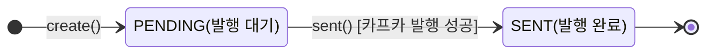

# [유저 애플리케이션 서비스] 도메인 모델 명세서

> 본 문서는 `유저 서비스`의 비지니스 요구 사항을 해결하기 위한 도메인 객체 구조, 역할, 핵심 비지니스 규칙을 정의한다.

## 1. 개요 (Overview)

- **도메인 목적**: 사용자 계정 정보와 배송지, 포인트 잔액 및 변동 이력을 관리하고, 인증에 필요한 리프레시 토큰의 발급·검증 흐름과 다른 서비스와의 안정적인 메시지 발행(Transactional
  Outbox)을 관리한다.
- **주요 아키텍처 패턴**: `Domain-Driven Design`, `Hexagonal Architecture`, `Transactional Outbox Pattern`

## 2. 애그리거트 명세 (Aggregate Specifications)

### 2.1 유저 (`User`- Aggregate Root)

사용자의 계정 정보(이메일, 비밀번호, 개인정보, 포인트, 권한)와 배송지 목록을 관리하고, 배송지 등록·삭제에 따른 대표 배송지 규칙 및 포인트 증감의 정합성을 보장한다.

### 2.1.1 속성 (Attribute)

| 필드명                 | 타입                      | 설명            |
|---------------------|-------------------------|---------------|
| `id`                | `Long`                  | 유저 식별자        |
| `email`             | `String`                | 이메일           |
| `name`              | `String`                | 이름            |
| `encryptedPwd`      | `String`                | 암호화된 비밀번호     |
| `phoneNumber`       | `String`                | 전화번호          |
| `gender`            | `Gender`                | 성별            |
| `birthDate`         | `LocalDate`             | 생년월일          |
| `point`             | `Money`                 | 보유 포인트        |
| `role`              | `Role`                  | 권한            |
| `shippingAddresses` | `List<ShippingAddress>` | 등록된 배송지 목록    |
| `version`           | `Long`                  | 낙관적 락을 위한 버전값 |

### 2.1.2 핵심 도메인 규칙 (Invariants / Business Rules)

- [규칙 1: 유저 생성 시 모든 정보는 필수이다.]
    1. `id`, `email`, `name`, `encryptedPwd`, `phoneNumber`, `gender`, `birthDate`, `point`, `role` 중 하나라도 누락되면 유저를 생성할
       수 없다.
- [규칙 2: 유저 생성 시 포인트는 0으로 시작한다.]
    1. 유저가 생성되면 `point`는 `Money.ZERO`로 초기화된다.
- [규칙 3: 유저 생성 시 권한은 일반 사용자로 고정된다.]
    1. 유저가 생성되면 `role`은 항상 `ROLE_USER`로 설정된다.
- [규칙 4: 대표 배송지는 항상 최대 1개만 존재한다.]
    1. 새 배송지를 명시적으로 대표로 지정하거나, 기존 배송지가 하나도 없거나, 기존 배송지 중 대표가 하나도 없는 경우 새 배송지가 대표로 지정된다.
    2. 새 배송지가 대표로 지정되면 기존 대표 배송지는 대표 상태에서 해제된다.
- [규칙 5: 삭제할 배송지는 해당 유저에 존재하는 배송지여야 한다.]
    1. 존재하지 않는 `shippingAddressId`로 배송지를 삭제할 수 없다.
- [규칙 6: 대표 배송지가 삭제되면 남은 배송지 중 하나가 새로운 대표로 승격된다.]
    1. 삭제된 배송지가 대표였고 삭제 후에도 남은 배송지가 있다면, 남은 배송지 중 첫 번째 배송지를 새로운 대표 배송지로 승격한다.
- [규칙 7: 포인트를 차감할 때 보유 포인트보다 많은 금액을 차감할 수 없다.]
    1. `deductPoints` 호출 시 차감할 금액이 현재 보유 포인트보다 크면 예외가 발생한다.
- [규칙 8: 포인트(및 배송지) 변경은 낙관적 락으로 동시 수정을 감지한다.]
    1. 동일 유저에 대한 두 개의 트랜잭션이 동시에 커밋을 시도하면 `version` 불일치로 인해 하나는 실패하며, 이는 재시도 대상이 되어 순차적으로 재적용되어야 한다.

### 2.1.3 주요 행위 (Behavior / Commands)

| 메서드명/행위                     | 파라미터                           | 반환값               | 비지니스 의도 및 제약                                                              |
|-----------------------------|--------------------------------|-------------------|---------------------------------------------------------------------------|
| `create`                    | `CreateUserContext`            | `User`            | 유저를 생성한다. 전달받은 식별자와 암호화된 비밀번호를 사용하며, 포인트는 0으로, 권한은 `ROLE_USER`로 초기화한다.    |
| `addShippingAddress`        | `CreateShippingAddressContext` | `void`            | 배송지를 추가한다. 대표 지정 조건을 판단하여 필요 시 기존 대표 배송지를 해제한 뒤 새 배송지를 생성하여 등록한다.         |
| `removeShippingAddress`     | `shippingAddressId`            | `void`            | 유저의 배송지를 제거한다. 대상 배송지가 존재해야 하며, 제거한 배송지가 대표였다면 남은 배송지 중 하나를 새로운 대표로 승격한다. |
| `getDefaultShippingAddress` | 없음                             | `ShippingAddress` | 유저의 대표 배송지를 조회한다. 배송지가 없으면 `null`을 반환한다.                                  |
| `addPoints`                 | `Money`                        | `void`            | 포인트를 적립한다.                                                                |
| `deductPoints`              | `Money`                        | `void`            | 포인트를 차감한다. 차감할 금액이 보유 포인트보다 크면 예외가 발생한다.                                  |

### 2.1.4 내부 구성 요소(Entities & Value Objects)

#### 하위 엔티티: 배송지 (`ShippingAddress`)

**역할**: 유저에게 종속된 개별 배송지 정보와 대표 배송지 여부를 관리한다.

**속성 (Attribute)**

| 필드명             | 타입        | 설명        |
|-----------------|-----------|-----------|
| `id`            | `Long`    | 배송지 식별자   |
| `user`          | `User`    | 소속 유저     |
| `receiverName`  | `String`  | 수령인 이름    |
| `receiverPhone` | `String`  | 수령인 전화번호  |
| `zipCode`       | `String`  | 우편번호      |
| `address`       | `String`  | 주소        |
| `addressDetail` | `String`  | 상세 주소     |
| `isDefault`     | `boolean` | 대표 배송지 여부 |

**도메인 규칙**

- [규칙 1: 배송지 생성 시 식별 정보와 주소 정보는 필수이다.]
    1. `id`, `user`, `receiverName`, `receiverPhone`, `zipCode`, `address`, `addressDetail`이 없으면 배송지를 생성할 수 없다.

**주요 행위**

| 메서드명/행위             | 파라미터                                                        | 반환값               | 비지니스 의도 및 제약                                                      |
|---------------------|-------------------------------------------------------------|-------------------|-------------------------------------------------------------------|
| `create`            | `User`, `CreateShippingAddressContext`, `resolvedIsDefault` | `ShippingAddress` | 배송지를 생성한다. 소속 유저와 최종 결정된 대표 여부를 설정한다. (`User`에서만 호출되는 패키지 전용 메서드) |
| `promoteToDefault`  | 없음                                                          | `void`            | 배송지를 대표 배송지로 승격한다.                                                |
| `demoteFromDefault` | 없음                                                          | `void`            | 배송지의 대표 상태를 해제한다.                                                 |

#### 값 객체: 성별 (`Gender`)

**역할**: 유저의 성별을 표현하는 열거형(`MALE`, `FEMALE`)

**주요 행위**

| 메서드명/행위 | 파라미터     | 반환값      | 비지니스 의도 및 제약                                                  |
|---------|----------|----------|---------------------------------------------------------------|
| `from`  | `String` | `Gender` | 문자열 값을 `Gender`로 변환한다. 값이 없거나 일치하는 항목이 없으면 기본값인 `MALE`을 반환한다. |

#### 값 객체: 권한 (`Role`)

**역할**: 유저의 권한을 표현하는 열거형(`ROLE_USER`: 사용자, `ROLE_ADMIN`: 관리자). 유저 서비스뿐 아니라 공통 모듈(`common.domain.vo`)에 위치하여 인증(JWT) 클레임 등
여러 곳에서 재사용된다.

---

### 2.2 리프레시 토큰 (`RefreshToken`- Aggregate Root)

사용자의 인증 갱신에 사용되는 리프레시 토큰 정보를 관리하며, 제시된 토큰이 저장된 토큰과 일치하는지 검증한다. RDB가 아닌 Redis에 `userId` 기준 단일 키로 저장되고 TTL이 만료되면 자동으로
소멸한다.

### 2.2.1 속성 (Attribute)

| 필드명      | 타입         | 설명        |
|----------|------------|-----------|
| `userId` | `Long`     | 사용자 식별자   |
| `token`  | `String`   | 리프레시 토큰 값 |
| `ttl`    | `Duration` | 토큰 만료 기간  |

### 2.2.2 핵심 도메인 규칙 (Invariants / Business Rules)

- [규칙 1: 리프레시 토큰 생성 시 모든 정보는 필수이다.]
    1. `userId`, `token`, `ttl` 중 하나라도 없으면 리프레시 토큰을 생성할 수 없다.
- [규칙 2: 유저 1명당 최신 리프레시 토큰 1개만 유효하다.]
    1. Redis에 `userId`를 키로 단일 값으로 저장되므로, 새로 로그인하거나 토큰을 재발급하면 이전 토큰은 자동으로 대체된다.

### 2.2.3 주요 행위 (Behavior / Commands)

| 메서드명/행위     | 파라미터                        | 반환값            | 비지니스 의도 및 제약                                                    |
|-------------|-----------------------------|----------------|-----------------------------------------------------------------|
| `create`    | `CreateRefreshTokenContext` | `RefreshToken` | 사용자 식별자, 토큰 값, 만료 기간을 기반으로 리프레시 토큰을 생성한다.                       |
| `isMatches` | `target`                    | `boolean`      | 전달받은 토큰 값이 저장된 토큰과 동일한지 확인한다. 일치하지 않으면 토큰 탈취/불일치로 간주되어 즉시 폐기된다. |

---

### 2.3 포인트 변동 이력 (`PointHistory`- Aggregate Root)

유저의 포인트 적립/차감 각 건을 불변으로 기록하는 원장(Ledger)이다. 동일한 연관 식별자(`referenceId`)로 중복 반영되는 것을 DB 유니크 제약으로 원천 차단하여, 포인트 사가 커맨드 재수신(
Kafka at-least-once) 시에도 이중 반영되지 않도록 멱등성을 보장한다.

### 2.3.1 속성 (Attribute)

| 필드명           | 타입                 | 설명                                              |
|---------------|--------------------|-------------------------------------------------|
| `id`          | `Long`             | 포인트 이력 식별자                                      |
| `referenceId` | `Long`             | 포인트 변동의 연관(원인) 식별자 — 포인트 사가의 `executionId`가 저장됨 |
| `user`        | `User`             | 대상 유저                                           |
| `amount`      | `Money`            | 변동 금액                                           |
| `type`        | `PointCommandType` | 변동 유형(`ADD`/`DEDUCT`)                           |

### 2.3.2 핵심 도메인 규칙 (Invariants / Business Rules)

- [규칙 1: 포인트 이력 생성 시 모든 정보는 필수이다.]
    1. `id`, `referenceId`, `user`, `amount`, `type` 중 하나라도 없으면 이력을 생성할 수 없다.
- [규칙 2: 동일한 연관 식별자(`referenceId`)로는 하나의 이력만 존재할 수 있다.]
    1. `point_history` 테이블의 `reference_id` 컬럼에 유니크 제약(`uk_point_history_reference_id`)이 걸려 있어, 동일 `referenceId`로 중복 생성을
       시도하면 DB 레벨에서 차단된다. 애플리케이션 계층에서는 `existsByReferenceId` 사전 확인으로 대부분의 중복 요청을 조기에 걸러내고, 이 유니크 제약은 그 사전 확인을 통과한 극히 드문
       동시 중복 요청에 대한 최종 안전망 역할을 한다.
- [규칙 3: 포인트 이력은 생성 이후 변경되지 않는다.]
    1. 상태를 변경하는 행위(behavior)가 존재하지 않는 INSERT-only 불변 레코드이다.

### 2.3.3 주요 행위 (Behavior / Commands)

| 메서드명/행위               | 파라미터                                 | 반환값            | 비지니스 의도 및 제약                         |
|-----------------------|--------------------------------------|----------------|--------------------------------------|
| `createAddHistory`    | `id`, `referenceId`, `User`, `Money` | `PointHistory` | 포인트 적립 이력을 생성한다. 유형을 `ADD`로 고정한다.    |
| `createDeductHistory` | `id`, `referenceId`, `User`, `Money` | `PointHistory` | 포인트 차감 이력을 생성한다. 유형을 `DEDUCT`로 고정한다. |

#### 값 객체: 포인트 변동 유형 (`PointCommandType`)

**역할**: 포인트 변동의 방향을 표현하는 열거형(`ADD`: 적립, `DEDUCT`: 차감)

---

### 2.4 아웃박스 메시지 (`OutboxMessage`- Aggregate Root)

트랜잭션 커밋과 메시지 발행 사이의 정합성(Transactional Outbox Pattern)을 보장하기 위한 기술 지원 애그리거트. 비즈니스 트랜잭션과 동일한 트랜잭션 안에서 메시지를 저장해 두었다가, 별도의
발행 경로(즉시 발행 또는 스윕)를 통해 카프카로 내보내고 발행 완료 상태를 기록한다.

### 2.4.1 속성 (Attribute)

| 필드명          | 타입             | 설명                     |
|--------------|----------------|------------------------|
| `id`         | `Long`         | 아웃박스 메시지 식별자           |
| `topic`      | `String`       | 발행 대상 카프카 토픽           |
| `routingKey` | `String`       | 카프카 메시지 키(파티션 라우팅 키)   |
| `headers`    | `String`       | 카프카 메시지 헤더(JSON 직렬화)   |
| `payload`    | `String`       | 카프카 메시지 페이로드(JSON 직렬화) |
| `status`     | `OutboxStatus` | 발행 처리 상태               |

### 2.4.2 생명 주기 및 상태 흐름 (Lifecycle & State)

#### 상태 전이 규칙

| 이전 상태     | 행위/메서드     | 다음 상태     | 비지니스 제약 및 의도                          |
|-----------|------------|-----------|---------------------------------------|
| `(None)`  | `create()` | `PENDING` | 비즈니스 트랜잭션 커밋과 함께 발행 대기 상태로 메시지를 생성한다. |
| `PENDING` | `sent()`   | `SENT`    | 카프카 발행에 성공한 메시지를 발행 완료 상태로 전이시킨다.     |

### 2.4.3 핵심 도메인 규칙 (Invariants / Business Rules)

- [규칙 1: 아웃박스 메시지 생성 시 모든 정보는 필수이다.]
    1. `id`, `topic`, `routingKey`, `headers`, `payload`, `status` 중 하나라도 없으면 생성할 수 없다.
- [규칙 2: 아웃박스 메시지는 `PENDING` 상태로 생성된다.]
    1. 생성 시 초기 상태는 항상 `PENDING`이다.
- [규칙 3: `PENDING` 상태의 메시지만 발행 완료로 전이할 수 있다.]
    1. `PENDING`이 아닌 메시지에 `sent()`를 호출하면 예외(`INVALID_OUTBOX_MESSAGE_STATUS`)가 발생한다.

### 2.4.4 주요 행위 (Behavior / Commands)

| 메서드명/행위  | 파라미터                         | 반환값             | 비지니스 의도 및 제약                                     |
|----------|------------------------------|-----------------|--------------------------------------------------|
| `create` | `CreateOutboxMessageContext` | `OutboxMessage` | 아웃박스 메시지를 생성한다. 초기 상태를 `PENDING`으로 설정한다.         |
| `sent`   | 없음                           | `void`          | 메시지를 발행 완료 상태로 전이한다. `PENDING` 상태가 아니면 예외가 발생한다. |

#### 값 객체: 아웃박스 상태 (`OutboxStatus`)

**역할**: 아웃박스 메시지의 처리 상태를 표현하는 열거형(`PENDING`, `SENT`)

## 3. 공통 도메인 요소 (Common Domain Elements)

### 3.1 금액 (`Money`)

서비스 전반(유저 포인트, 포인트 이력)에서 사용되는 금액(원 단위)을 표현하는 불변 값 객체로, 음수 금액을 원천적으로 차단하고 금액 간 연산의 일관성을 보장한다.

### 3.1.1 속성 (Attribute)

| 필드명      | 타입           | 설명   |
|----------|--------------|------|
| `amount` | `BigDecimal` | 금액 값 |

### 3.1.2 핵심 도메인 규칙 (Invariants / Business Rules)

- [규칙 1: 금액은 `null`이거나 음수일 수 없다.]
    1. `wons` 생성 시 전달받은 값이 `null`이거나 0보다 작으면 예외가 발생한다.
- [규칙 2: 차감 금액은 현재 금액보다 클 수 없다.]
    1. `subtract` 호출 시 차감할 금액이 현재 금액보다 크면 예외가 발생한다.
- [규칙 3: 금액에 음수를 곱할 수 없다.]
    1. `multiple` 계열 메서드 호출 시 곱하는 값이 음수이면 예외가 발생한다.
- [규칙 4: 실수 배율 연산 결과는 소수점 이하를 절사한다.]
    1. `double` 또는 `BigDecimal` 배율로 곱한 결과는 소수점 이하를 버림(내림) 처리하여 원 단위로 보정한다.
- [규칙 5: 소수점 표현이 달라도 값이 같으면 동일한 금액으로 취급한다.]
    1. 금액 비교(`equals`/`hashCode`) 시 trailing zero 차이는 무시하고 실제 값으로 비교한다.

### 3.1.3 주요 행위 (Behavior / Commands)

| 메서드명/행위          | 파라미터                         | 반환값       | 비지니스 의도 및 제약                                                   |
|------------------|------------------------------|-----------|----------------------------------------------------------------|
| `wons`           | `amount`                     | `Money`   | 원 단위 금액 객체를 생성한다. 값이 `null`이거나 음수면 생성할 수 없고, 0이면 `ZERO`를 반환한다. |
| `add`            | `Money`                      | `Money`   | 금액을 더한 새로운 금액을 반환한다.                                           |
| `subtract`       | `Money`                      | `Money`   | 금액을 차감한 새로운 금액을 반환한다. 현재 금액보다 큰 값은 차감할 수 없다.                   |
| `multiple`       | `long`/`double`/`BigDecimal` | `Money`   | 금액에 배율을 곱한다. 실수 배율 연산은 소수점을 절사한다.                              |
| `longValue`      | 없음                           | `long`    | 금액을 `long` 값으로 반환한다.                                           |
| `isLessThan`     | `Money`                      | `boolean` | 다른 금액보다 작은지 비교한다.                                              |
| `isGreaterThan`  | `Money`                      | `boolean` | 다른 금액보다 큰지 비교한다.                                               |
| `min`            | `Money`, `Money`             | `Money`   | 두 금액 중 작은 값을 반환한다.                                             |
| `max`            | `Money`, `Money`             | `Money`   | 두 금액 중 큰 값을 반환한다.                                              |
| `truncateToTens` | 없음                           | `Money`   | 금액을 10원 단위로 절사한다.                                              |
